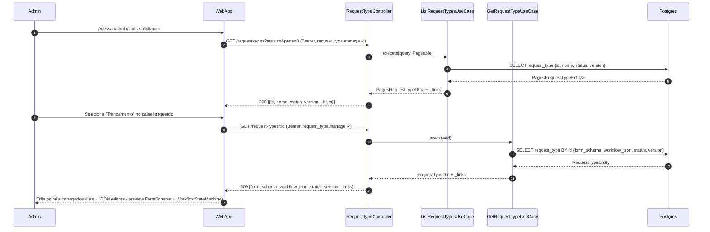
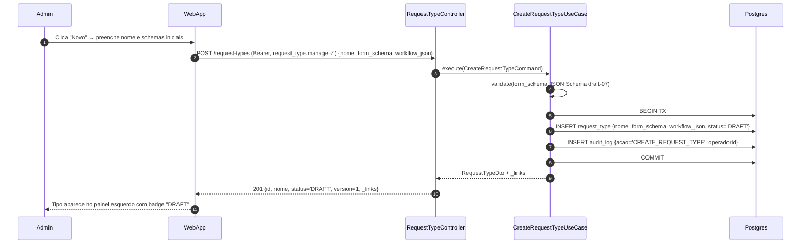
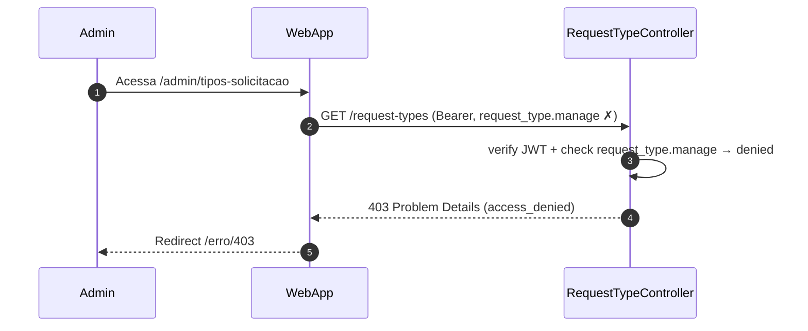
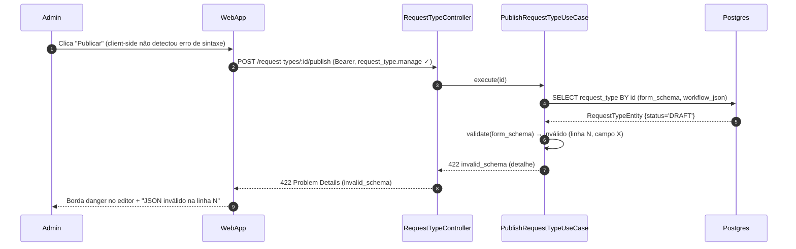
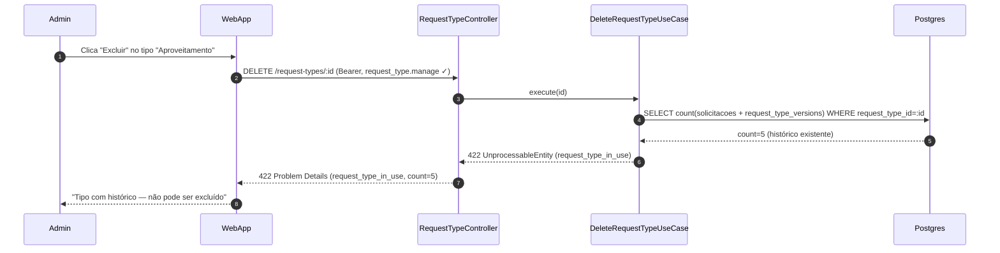

# US-F7-003 — Editor de Tipos de Solicitação (Workflow Engine)

| Campo | Valor |
|-------|-------|
| **HU** | US-F7-003 |
| **Tela** | F7.4 — Tipos de Solicitação |
| **Capability** | `request_type.manage` |
| **API primária** | `GET /request-types` · `POST /request-types` · `PATCH /request-types/:id` · `POST /request-types/:id/publish` · `DELETE /request-types/:id` |
| **Fonte** | `fluxos_por_perfil.md` §8.2 · `US-F7-003-WORKFLOW-ENGINE.md` · ADR-003 |

> ⚠️ **ADR-003 — Coração DRY:** cada `RequestType` publicado aqui substitui múltiplos arquivos de código. Diagramas desta HU cobrem apenas a gestão do catálogo; a execução do workflow (transições de solicitações) está em US-F1-005, US-F3-003, US-F5-002.

---

## Matriz de cobertura

| ID diagrama | Origem (CA/RN) | Classe | Status |
|-------------|----------------|--------|--------|
| F7.4-D01 | CA-01 · RN-01 · RN-02 · RN-11 | SEQUENCIA | gerado |
| F7.4-D02 | CA-07 · RN-08 · RN-10 | SEQUENCIA | gerado |
| F7.4-D03 | CA-02 (persistir draft) · RN-03 · RN-04 · RN-10 | SEQUENCIA | gerado |
| F7.4-D04 | CA-04 · RN-07 · RN-08 · RN-10 | SEQUENCIA | gerado |
| F7.4-ERRO-01 | CA-01 (403 FGAC) | ERRO | gerado |
| F7.4-ERRO-02 | CA-03 (server-side) · RN-03 | ERRO | gerado |
| F7.4-ERRO-03 | RN-09 (DELETE com histórico) | ERRO | gerado |
| — | CA-02 preview ao vivo | NAO_APLICAVEL | rendering client-side (Monaco + JSON Schema preview) |
| — | CA-03 borda danger | NAO_APLICAVEL | validação client-side no editor; 422 server-side → ERRO-02 |
| — | CA-05 versionamento isolamento | DRY → F7.4-D04 | comportamento interno do publish (RN-07 capturado em D04) |
| — | CA-06 grafo reflete JSON | NAO_APLICAVEL | `DS/WorkflowStateMachineEditor` — re-render client-side |
| — | RN-05 DS/FormSchemaPreview | NAO_APLICAVEL | frontend only — sem chamada backend |
| — | RN-06 DS/WorkflowStateMachineEditor | NAO_APLICAVEL | frontend only — sem chamada backend |

---

## Referências DRY

| Ref | Destino | Motivo |
|-----|---------|--------|
| CA-05 versionamento isolamento | F7.4-D04 (este arquivo) | Solicitações existentes mantêm `request_type_version_id` da versão anterior — lógica do `COMMIT` em D04 |
| F7.4-ERRO-01 (403 padrão) | [`F7/US-F7-001-IAM-USUARIOS.md` F7.1-ERRO-01](US-F7-001-IAM-USUARIOS.md) | Mesmo padrão `@PreAuthorize` — capability `request_type.manage` |
| Execução de transições de workflow | `F1/US-F1-005`, `F3/US-F3-003`, `F5/US-F5-002` | Esta HU cobre o **editor** do catálogo; as transições em runtime (ABERTA → EM_ANALISE → DELIBERADA) estão nas HUs de solicitações |

---

## Fora de sequência

| Item | Motivo |
|------|--------|
| CA-02 — preview ao vivo | `DS/FormSchemaPreview` re-renderiza client-side a cada keystroke (React state); sem chamada backend |
| CA-03 — borda danger | Validação JSON syntax no Monaco Editor (client-side); validação semântica de JSON Schema draft-07 no backend ocorre no publish → F7.4-ERRO-02 |
| CA-06 — grafo reflete JSON | `DS/WorkflowStateMachineEditor` re-renderiza client-side ao atualizar `workflow_json` em memória |
| Execução de sandbox/simulação | Fora de escopo do MVP (RN) |
| Importação de schema via arquivo | Fora de escopo |

---

## F7.4-D01 — Listar tipos e carregar editor de três painéis

**Escopo:** happy path — admin acessa `/admin/tipos-solicitacao`; lista é carregada e o tipo selecionado popula os painéis central e direito  
**Atores:** Admin, WebApp, RTController, ListRTUseCase, GetRTUseCase, Postgres  
**Pré-condições:** admin com `request_type.manage`



**Notas:**
- Painel esquerdo: lista com badges `DRAFT` / `PUBLISHED` e contagem dos 19 tipos (RN-11)
- Painel central: dois `DS/JsonSchemaEditor` com os conteúdos `form_schema` e `workflow_json` do tipo selecionado
- Painel direito: `DS/FormSchemaPreview` + `DS/WorkflowStateMachineEditor` populados client-side a partir da resposta 200
- `_links` inclui: `publish` (se DRAFT + válido), `save-draft`, `delete` (se DRAFT sem histórico)

**Lacunas:** nenhuma

---

## F7.4-D02 — Criar novo RequestType (POST → status DRAFT)

**Escopo:** happy path — admin cria novo tipo "Monitoria" com schemas iniciais; sistema persiste como DRAFT  
**Atores:** Admin, WebApp, RTController, CreateRTUseCase, Postgres  
**Pré-condições:** admin com `request_type.manage`



**Notas:**
- Schema inválido na criação → self-call retorna 422 antes da TX (ver F7.4-ERRO-02 para publish; mesma lógica)
- `audit_log` registra payload completo de `form_schema` e `workflow_json` (RN-10)
- Tipo `DRAFT` não aparece no wizard de nova solicitação (F1.8/F5.3) — RN-08
- Diagrama relacionado: F7.4-D04 (publicar após edição)

**Lacunas:** nenhuma

---

## F7.4-D03 — Salvar rascunho (PATCH form_schema + workflow_json)

**Escopo:** happy path — admin edita schemas de um tipo DRAFT e persiste o rascunho sem publicar  
**Atores:** Admin, WebApp, RTController, SaveDraftUseCase, Postgres  
**Pré-condições:** tipo alvo em `status='DRAFT'`; admin com `request_type.manage`

```mermaid
sequenceDiagram
    autonumber
    participant Admin
    participant WebApp
    participant RTController as RequestTypeController
    participant SaveDraftUC as SaveDraftUseCase
    participant Postgres

    Admin->>WebApp: Edita form_schema / workflow_json → clica "Salvar rascunho"
    WebApp->>RTController: PATCH /request-types/:id (Bearer, request_type.manage ✓) {form_schema, workflow_json}
    RTController->>SaveDraftUC: execute(id, delta, operadorId)
    SaveDraftUC->>SaveDraftUC: validate(form_schema JSON Schema draft-07)
    SaveDraftUC->>Postgres: BEGIN TX
    SaveDraftUC->>Postgres: UPDATE request_type SET form_schema, workflow_json WHERE id=:id AND status='DRAFT'
    SaveDraftUC->>Postgres: INSERT audit_log {acao='SAVE_DRAFT', operadorId, payload}
    SaveDraftUC->>Postgres: COMMIT
    SaveDraftUC-->>RTController: RequestTypeDto + _links
    RTController-->>WebApp: 200 {form_schema, workflow_json, status='DRAFT', _links}
    WebApp-->>Admin: Rascunho salvo; preview e grafo atualizados no painel direito
```

**Notas:**
- PATCH só possível enquanto `status='DRAFT'` — tipos `PUBLISHED` não são editados in-place (nova publicação cria versão)
- `audit_log` inclui payload completo dos schemas para rastreabilidade de versionamento (RN-10)
- `validate()` no UseCase: schema inválido → 422 antes da TX (F7.4-ERRO-02)
- Após COMMIT, client-side atualiza `DS/FormSchemaPreview` e `DS/WorkflowStateMachineEditor` a partir da resposta 200

**Lacunas:** nenhuma

---

## F7.4-D04 — Publicar versão (POST /publish + versionamento atômico)

**Escopo:** happy path — admin publica um RequestType DRAFT; nova versão imutável é criada; solicitações existentes mantêm a versão anterior  
**Atores:** Admin, WebApp, RTController, PublishRequestTypeUseCase, Postgres  
**Pré-condições:** tipo em `status='DRAFT'`; `form_schema` e `workflow_json` válidos; admin com `request_type.manage`

```mermaid
sequenceDiagram
    autonumber
    participant Admin
    participant WebApp
    participant RTController as RequestTypeController
    participant PublishRTUC as PublishRequestTypeUseCase
    participant Postgres

    Admin->>WebApp: Schemas válidos → clica "Publicar"
    WebApp->>RTController: POST /request-types/:id/publish (Bearer, request_type.manage ✓)
    RTController->>PublishRTUC: execute(id, operadorId)
    PublishRTUC->>Postgres: SELECT request_type BY id (status, form_schema, workflow_json)
    Postgres-->>PublishRTUC: RequestTypeEntity {status='DRAFT', version=N}
    PublishRTUC->>PublishRTUC: validate(form_schema + workflow_json)
    PublishRTUC->>Postgres: BEGIN TX
    PublishRTUC->>Postgres: INSERT request_type_version {snapshot, version=N+1} (immutable)
    PublishRTUC->>Postgres: UPDATE request_type SET status='PUBLISHED', currentVersion=N+1
    PublishRTUC->>Postgres: INSERT audit_log {acao='PUBLISH', operadorId, version=N+1}
    PublishRTUC->>Postgres: COMMIT
    PublishRTUC-->>RTController: RequestTypeDto {status='PUBLISHED', version=N+1}
    RTController-->>WebApp: 200 {id, nome, status='PUBLISHED', version=N+1, _links}
    WebApp-->>Admin: Badge "PUBLISHED"; wizard F1.8/F5.3 usa versão N+1
```

**Notas:**
- `request_type_version` é imutável — snapshot completo de `form_schema` + `workflow_json` na versão N+1 (RN-07)
- Solicitações abertas mantêm `request_type_version_id = N` (CA-05 → DRY — FK preservada na criação da solicitação)
- A partir deste `COMMIT`, o wizard de nova solicitação (F1.8/F5.3) resolve `currentVersion = N+1`
- Schema inválido no momento do publish → 422 antes da TX (F7.4-ERRO-02)

**Lacunas:** nenhuma

---

## F7.4-ERRO-01 — 403 FGAC: request_type.manage ausente

**Escopo:** erro — usuário sem `request_type.manage` tenta acessar `/admin/tipos-solicitacao`  
**Atores:** Admin (sem permissão), WebApp, RTController  
**Pré-condições:** token JWT válido; sem `request_type.manage` nas authorities



**Notas:**
- `@PreAuthorize("hasAuthority('request_type.manage')")` — Spring Security rejeita antes do use case
- DRY → [F7.1-ERRO-01](US-F7-001-IAM-USUARIOS.md) — padrão idêntico (`@PreAuthorize` + RFC 7807 403)
- Aplica-se a todos os endpoints desta HU (GET, POST, PATCH, DELETE, POST /publish)

**Lacunas:** nenhuma

---

## F7.4-ERRO-02 — 422 Schema inválido no publish (server-side)

**Escopo:** erro — admin tenta publicar `RequestType` com `form_schema` malformado; API rejeita antes da TX  
**Atores:** Admin, WebApp, RTController, PublishRequestTypeUseCase, Postgres  
**Pré-condições:** tipo em `status='DRAFT'`; `form_schema` com JSON inválido (ex.: chave sem fechar)



**Notas:**
- RFC 7807: `type: invalid_schema`, `status: 422`, `detail: "form_schema: SyntaxError at line N"` — corpo completo em **Notas**
- Mesma lógica aplica-se ao `workflow_json` inválido (tipo: `invalid_workflow`)
- Validação client-side (Monaco) é best-effort — server-side é a barreira definitiva (RN-03)
- Nenhuma TX é iniciada antes do validate — sem efeito colateral

**Lacunas:** nenhuma

---

## F7.4-ERRO-03 — 422 Excluir RequestType com histórico

**Escopo:** erro — admin tenta excluir um `RequestType` que possui solicitações ou versões históricas; API rejeita com 422  
**Atores:** Admin, WebApp, RTController, DeleteRequestTypeUseCase, Postgres  
**Pré-condições:** admin com `request_type.manage`; tipo alvo com solicitações ou versões existentes



**Notas:**
- RFC 7807: `type: request_type_in_use`, `status: 422`, `detail: "5 solicitações vinculadas"` — corpo completo em **Notas**
- Apenas tipos em `status='DRAFT'` sem nenhuma `request_type_version` e sem solicitações podem ser excluídos (RN-09)
- `_links` omite `delete` para tipos PUBLISHED → botão ausente via HATEOAS (capturado em F7.4-D01)
- Padrão idêntico a F7.2-ERRO-01 (excluir perfil com usuários ativos)

**Lacunas:** nenhuma
