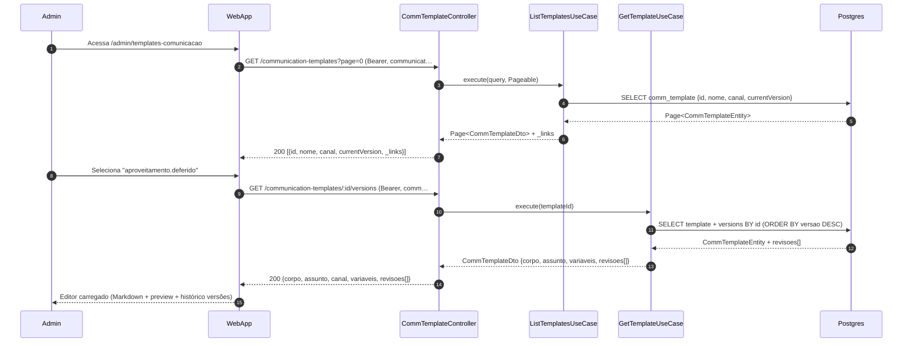
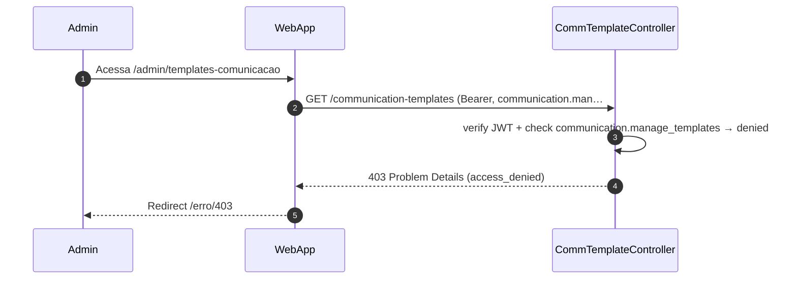

# US-F7-004 — Templates de Comunicação

| Campo | Valor |
|-------|-------|
| **HU** | US-F7-004 |
| **Tela** | F7.5 — Templates de Comunicação |
| **Capability** | `communication.manage_templates` |
| **API primária** | `GET /communication-templates` · `POST /communication-templates` · `POST /communication-templates/:id/revisions` · `GET /communication-templates/:id/versions` · `GET /communication-templates/:id/versions/:rev` |
| **Fonte** | `fluxos_por_perfil.md` §8.3 · `US-F7-004-TEMPLATES-COMUNICACAO.md` |

---

## Matriz de cobertura

| ID diagrama | Origem (CA/RN) | Classe | Status |
|-------------|----------------|--------|--------|
| F7.5-D01 | CA-01 · RN-01..03 · RN-07 | SEQUENCIA | gerado |
| F7.5-D02 | (Novo template) · RN-02 · RN-06 · RN-10 | SEQUENCIA | gerado |
| F7.5-D03 | CA-04 · RN-06 · RN-10 | SEQUENCIA | gerado |
| F7.5-D04 | CA-05 · RN-07 | SEQUENCIA | gerado |
| F7.5-ERRO-01 | CA-01 (403 FGAC) | ERRO | gerado |
| — | CA-02 preview ao vivo | NAO_APLICAVEL | Markdown re-render client-side (React state) |
| — | CA-03 placeholder inválido | NAO_APLICAVEL | highlight client-side — lista `variaveis` carregada em D01 |
| — | CA-06 autocomplete `{{` | NAO_APLICAVEL | UX do DS/MarkdownEditor — sem chamada backend |
| — | RN-04 autocomplete | NAO_APLICAVEL | client-side |
| — | RN-05 DS/TemplatePreview | NAO_APLICAVEL | client-side render — sem chamada backend |
| — | RN-08 placeholder destacado danger | NAO_APLICAVEL | lógica do preview client-side (variáveis carregadas em D01) |
| — | RN-09 renomear → atualizar workflows | NAO_APLICAVEL | constraint operacional — não há endpoint de rename no contrato MVP |

---

## Referências DRY

| Ref | Destino | Motivo |
|-----|---------|--------|
| F7.5-ERRO-01 (403 padrão) | [`F7/US-F7-001-IAM-USUARIOS.md` F7.1-ERRO-01](US-F7-001-IAM-USUARIOS.md) | Mesmo padrão `@PreAuthorize` + RFC 7807 403 |
| Templates referenciados no workflow_json | [`F7/US-F7-003-WORKFLOW-ENGINE.md`](US-F7-003-WORKFLOW-ENGINE.md) | `"notificacoes": {"DELIBERADA": "template.aproveitamento.deferido"}` (RN-09); editor de templates é o catálogo; binding ocorre no Workflow Engine |
| Envio do e-mail pelo dispatcher | [`transversal/10.1-outbox-notificacao.md`](../transversal/10.1-outbox-notificacao.md) | Templates são **consumidos** pelo OutboxDispatcher ao enviar notificações; não há outbox nesta HU (gestão do catálogo apenas) |

---

## Fora de sequência

| Item | Motivo |
|------|--------|
| CA-02 — preview ao vivo | `DS/TemplatePreview` re-renderiza a cada keystroke com `corpo` local (React state); sem chamada backend |
| CA-03 — placeholder inválido em danger | Lógica de highlight client-side: compara placeholders do corpo contra `variaveis[]` recebido em D01; zero backend calls |
| CA-06 — autocomplete `{{` | `DS/MarkdownEditor` exibe sugestões a partir de `variaveis[]` já carregado — sem backend roundtrip |
| RN-09 — renomear template exige atualizar workflows | Constraint documentado; endpoint de rename não consta no contrato MVP |
| Exclusão de revisões | Proibida (RN-06 — auditabilidade) |
| SMS | Fora de escopo do MVP |

---

## F7.5-D01 — Listar templates e carregar editor (two-column)

**Escopo:** happy path — admin acessa `/admin/templates-comunicacao`, seleciona um template; editor de duas colunas é carregado com conteúdo, variáveis e histórico de versões  
**Atores:** Admin, WebApp, CTController, ListTemplatesUseCase, GetTemplateUseCase, Postgres  
**Pré-condições:** admin com `communication.manage_templates`



**Notas:**
- `variaveis[]` na resposta alimenta client-side: autocomplete de `{{` (CA-06) e validação de placeholders (CA-03) — sem chamadas adicionais
- Histórico `revisoes[]` inclui `{versao, autor, criadoEm, status}` para a coluna direita `DS/DataTable/Full`
- JwtFilter valida Bearer e verifica `communication.manage_templates` antes do controller (inline passo 2)
- Diagrama relacionado: F7.5-D03 (salvar revisão), F7.5-D04 (carregar versão anterior)

**Lacunas:** nenhuma

---

## F7.5-D02 — Criar novo template (POST)

**Escopo:** happy path — admin cria novo template de comunicação com primeira revisão  
**Atores:** Admin, WebApp, CTController, CreateTemplateUseCase, Postgres  
**Pré-condições:** admin com `communication.manage_templates`; nome do template inexistente

```mermaid
sequenceDiagram
    autonumber
    participant Admin
    participant WebApp
    participant CTController as CommTemplateController
    participant CreateTemplateUC as CreateTemplateUseCase
    participant Postgres

    Admin->>WebApp: Clica "Novo template" → preenche nome, assunto, corpo, …
    WebApp->>CTController: POST /communication-templates (Bearer, communication.ma…
    CTController->>CreateTemplateUC: execute(CreateTemplateCommand)
    CreateTemplateUC->>Postgres: SELECT comm_template BY nome (unicidade)
    Postgres-->>CreateTemplateUC: null (novo)
    CreateTemplateUC->>Postgres: BEGIN TX
    CreateTemplateUC->>Postgres: INSERT comm_template {nome, canal, variaveis}
    CreateTemplateUC->>Postgres: INSERT comm_template_revision {assunto, corpo, versao=1…
    CreateTemplateUC->>Postgres: INSERT audit_log {acao='CREATE_TEMPLATE', operadorId}
    CreateTemplateUC->>Postgres: COMMIT
    CreateTemplateUC-->>CTController: CommTemplateDto + _links
    CTController-->>WebApp: 201 {id, nome, versao=1, status='CURRENT', _links}
    WebApp-->>Admin: Template na lista; editor aberto com versão 1
```

**Notas:**
- Nome em dot-notation (ex.: `boas-vindas.egresso`) — único; 409 Conflict se já existir (verificado via `SELECT BY nome` antes da TX)
- TX atômica: cabeçalho do template + primeira revisão + `audit_log` no mesmo `COMMIT`
- `variaveis` lista os placeholders disponíveis (ex.: `[nome, protocolo, curso, link]`) — RN-02
- `audit_log` registra `operadorId`, `acao='CREATE_TEMPLATE'`, payload (RN-10)

**Lacunas:** nenhuma

---

## F7.5-D03 — Salvar revisão (POST /revisions + versionamento imutável)

**Escopo:** happy path — admin edita corpo/assunto e salva; nova revisão é criada como `CURRENT`; revisão anterior arquivada atomicamente  
**Atores:** Admin, WebApp, CTController, SaveRevisionUseCase, Postgres  
**Pré-condições:** template existente; admin com `communication.manage_templates`

```mermaid
sequenceDiagram
    autonumber
    participant Admin
    participant WebApp
    participant CTController as CommTemplateController
    participant SaveRevisionUC as SaveRevisionUseCase
    participant Postgres

    Admin->>WebApp: Edita corpo / assunto no DS/MarkdownEditor → clica "Sal…
    WebApp->>CTController: POST /communication-templates/:id/revisions (Bearer, co…
    CTController->>SaveRevisionUC: execute(templateId, delta, operadorId)
    SaveRevisionUC->>Postgres: BEGIN TX
    SaveRevisionUC->>Postgres: UPDATE comm_template_revision SET status='ARCHIVED' WHE…
    SaveRevisionUC->>Postgres: INSERT comm_template_revision {assunto, corpo, versao=N…
    SaveRevisionUC->>Postgres: INSERT audit_log {acao='SAVE_REVISION', operadorId, ver…
    SaveRevisionUC->>Postgres: COMMIT
    SaveRevisionUC-->>CTController: RevisionDto {versao=N+1, status='CURRENT', criadoEm}
    CTController-->>WebApp: 200 {revisao: N+1, status='CURRENT', criadoEm}
    WebApp-->>Admin: Histórico atualizado; versão N+1 marcada "CURRENT"
```

**Notas:**
- Revisões anteriores nunca são excluídas — apenas `status='ARCHIVED'` (RN-06 — auditabilidade imutável)
- TX atômica garante que não pode haver dois `CURRENT` simultâneos — `UPDATE → INSERT → COMMIT`
- Coluna direita `DS/DataTable/Full` atualiza a partir da resposta 200 (novo item no topo com status CURRENT)
- `audit_log` inclui `versao=N+1`, `operadorId`, `templateId`, `payload` resumido (RN-10)

**Lacunas:** nenhuma

---

## F7.5-D04 — Carregar versão anterior (somente leitura)

**Escopo:** happy path — admin clica em revisão arquivada no histórico; editor carrega conteúdo da versão em modo somente leitura  
**Atores:** Admin, WebApp, CTController, GetRevisionUseCase, Postgres  
**Pré-condições:** template com ≥ 2 revisões; admin com `communication.manage_templates`

```mermaid
sequenceDiagram
    autonumber
    participant Admin
    participant WebApp
    participant CTController as CommTemplateController
    participant GetRevisionUC as GetRevisionUseCase
    participant Postgres

    Admin->>WebApp: Clica na versão 1 no histórico (status='ARCHIVED')
    WebApp->>CTController: GET /communication-templates/:id/versions/1 (Bearer, co…
    CTController->>GetRevisionUC: execute(templateId, revisao=1)
    GetRevisionUC->>Postgres: SELECT comm_template_revision BY templateId AND versao=1
    Postgres-->>GetRevisionUC: RevisionEntity {assunto, corpo, versao=1, status='ARCHI…
    GetRevisionUC-->>CTController: RevisionDto {corpo, assunto, versao=1, status='ARCHIVED'}
    CTController-->>WebApp: 200 {…}
    WebApp-->>Admin: Editor readonly; banner "Versão 1 — somente leitura"; "…
```

**Notas:**
- Modo `readonly` é lógica UI baseada em `status='ARCHIVED'` na resposta — sem endpoint adicional (CA-05)
- Botão "Salvar" desabilitado pelo frontend; não há guard backend para leitura de versão arquivada
- O preview `DS/TemplatePreview` ainda renderiza o conteúdo da versão histórica client-side
- Para retornar à versão corrente: admin clica na revisão `CURRENT` no histórico (mesmo endpoint, `versions/N`)

**Lacunas:** nenhuma

---

## F7.5-ERRO-01 — 403 FGAC: communication.manage_templates ausente

**Escopo:** erro — usuário sem `communication.manage_templates` tenta acessar `/admin/templates-comunicacao`  
**Atores:** Admin (sem permissão), WebApp, CTController  
**Pré-condições:** token JWT válido; sem `communication.manage_templates` nas authorities



**Notas:**
- `@PreAuthorize("hasAuthority('communication.manage_templates')")` — Spring Security rejeita antes do use case
- DRY → [F7.1-ERRO-01](US-F7-001-IAM-USUARIOS.md) — padrão idêntico; capability diferente
- Aplica-se a todos os endpoints desta HU (GET, POST, POST /revisions, GET /versions, GET /versions/:rev)

**Lacunas:** nenhuma
