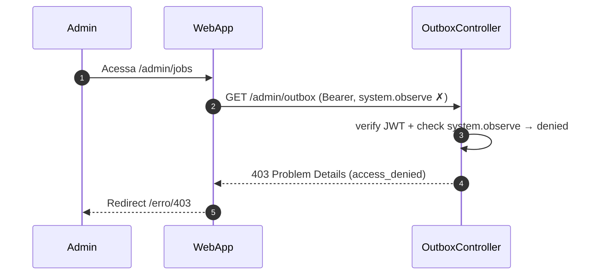

# US-F7-005 — Observabilidade do Outbox e Jobs Agendados

| Campo | Valor |
|-------|-------|
| **HU** | US-F7-005 |
| **Tela** | F7.6 — Jobs Outbox |
| **Capability** | `system.observe` |
| **API primária** | `GET /admin/outbox` · `POST /admin/outbox/:id/retry` · `GET /admin/scheduled-jobs` |
| **Fonte** | `fluxos_por_perfil.md` §8.4 · `US-F7-005-JOBS-OUTBOX.md` |

---

## Matriz de cobertura

| ID diagrama | Origem (CA/RN) | Classe | Status |
|-------------|----------------|--------|--------|
| F7.6-D01 | CA-01 · RN-01..04 · RN-06 · RN-10 | SEQUENCIA | gerado |
| F7.6-D02 | CA-03 · RN-05 · RN-06 | SEQUENCIA | gerado |
| F7.6-D03 | CA-05 · RN-08 · RN-09 | SEQUENCIA | gerado |
| F7.6-ERRO-01 | CA-01 (403 FGAC) | ERRO | gerado |
| — | CA-02 (filtrar aggregate type) | DRY → F7.6-D01 | mesmo `GET /admin/outbox` com `&aggregateType=` adicional |
| — | CA-04 (alerta latência > 30 s) | DRY → F7.6-D01 | `meta.oldestPendingMs` na resposta D01; avaliação > 30 000 ms e banner são client-side |
| — | CA-06 (retry ausente para SENT) | DRY → F7.6-D01 | `_links.retry` ausente para status SENT — capturado nos `_links` da listagem |
| — | RN-07 SLA dispatcher < 5 s | NAO_APLICAVEL | informação operacional da resposta; sem endpoint dedicado de health nesta HU |

---

## Referências DRY

| Ref | Destino | Motivo |
|-----|---------|--------|
| Fase TX do outbox (INSERT outbox_event) | [`transversal/10.1-outbox-notificacao.md` 10.1a](../transversal/10.1-outbox-notificacao.md) | Esta HU cobre a **observabilidade** (visualizar e reentregar); a fase TX de inserção do evento está em cada HU-OUTBOX e no transversal |
| Dispatch loop (5 s) | [`transversal/10.1-outbox-notificacao.md` 10.1b](../transversal/10.1-outbox-notificacao.md) | O `OutboxDispatcher` (@Scheduled) está modelado em 10.1b; F7.6-D02 apenas recoloca o evento em PENDING para o dispatcher processar |
| F7.6-ERRO-01 (403 padrão) | [`F7/US-F7-001-IAM-USUARIOS.md` F7.1-ERRO-01](US-F7-001-IAM-USUARIOS.md) | Mesmo padrão `@PreAuthorize` + RFC 7807 403 |

---

## Fora de sequência

| Item | Motivo |
|------|--------|
| CA-02 — filtrar por aggregate type | Mesmo `GET /admin/outbox?aggregateType=solicitacoes` — DRY → F7.6-D01 |
| CA-04 — alerta latência > 30 s | `meta.oldestPendingMs` retornado em D01; comparação > 30 000 ms e exibição do `DS/AlertBanner` são client-side |
| CA-06 — retry ausente para SENT | `_links.retry` ausente no item SENT — HATEOAS capturado em F7.6-D01 (`_links` por item) |
| RN-07 SLA < 5 s | Informação operacional derivada da resposta D01; sem endpoint de health dedicado nesta HU (métricas completas em Prometheus/Grafana — US-F7-007) |
| Payload completo do evento | Fora de escopo (apenas resumo; logs detalhados em Loki) |
| Cancelar evento PENDING | Fora de escopo |
| Configurar frequência de jobs pela UI | Fora de escopo |

---

## F7.6-D01 — Listar outbox events por status (happy path + HATEOAS)

**Escopo:** happy path — admin acessa `/admin/jobs` com aba FAILED ativa; API retorna eventos paginados com `_links` condicionais e metadados de latência do dispatcher  
**Atores:** Admin, WebApp, OutboxController, ListOutboxEventsUseCase, Postgres  
**Pré-condições:** admin com `system.observe`

```mermaid
sequenceDiagram
    autonumber
    participant Admin
    participant WebApp
    participant OutboxController
    participant ListOutboxEventsUC as ListOutboxEventsUseCase
    participant Postgres

    Admin->>WebApp: Acessa /admin/jobs (aba FAILED ativa por default)
    WebApp->>OutboxController: GET /admin/outbox?status=FAILED&page=0&size=20 (Bearer, system.observe ✓)
    OutboxController->>ListOutboxEventsUC: execute(OutboxQuery{status=FAILED, page})
    ListOutboxEventsUC->>Postgres: SELECT outbox_event BY status=FAILED ORDER BY created_at DESC
    ListOutboxEventsUC->>Postgres: SELECT min(created_at) WHERE status=PENDING (dispatcher lag)
    Postgres-->>ListOutboxEventsUC: Page<OutboxEventEntity> + oldestPendingCreatedAt
    ListOutboxEventsUC-->>OutboxController: Page<OutboxEventDto> + meta{oldestPendingMs}
    OutboxController-->>WebApp: 200 {…}
    WebApp-->>Admin: DS/OutboxEventTable; FAILED com badge danger; retry via _links.retry
```

**Notas:**
- `_links.retry` presente apenas para `status=FAILED` e `status=DEAD` (RN-06); ausente para SENT e PENDING — CA-06 → DRY (capturado aqui)
- `meta.oldestPendingMs` = `now - min(created_at) WHERE status=PENDING`; se > 30 000 → `DS/AlertBanner` exibido client-side (CA-04 → DRY)
- Filtro por `aggregateType` é adição de query param no mesmo endpoint — CA-02 → DRY
- Paginação 20 eventos/página (RN-10); eventos SENT retidos 7 dias antes de arquivamento automático

**Lacunas:** nenhuma

---

## F7.6-D02 — Reentregar evento DEAD/FAILED → PENDING

**Escopo:** happy path — admin clica "Reentregar" em evento DEAD; API recoloca o evento em PENDING para o próximo ciclo do OutboxDispatcher  
**Atores:** Admin, WebApp, OutboxController, RetryOutboxEventUseCase, Postgres  
**Pré-condições:** evento com `status=DEAD` ou `status=FAILED`; admin com `system.observe`

```mermaid
sequenceDiagram
    autonumber
    participant Admin
    participant WebApp
    participant OutboxController
    participant RetryOutboxEventUC as RetryOutboxEventUseCase
    participant Postgres

    Admin->>WebApp: Clica "Reentregar" na linha do evento DEAD (via _links.retry)
    WebApp->>OutboxController: POST /admin/outbox/:id/retry (Bearer, system.observe ✓)
    OutboxController->>RetryOutboxEventUC: execute(eventId, operadorId)
    RetryOutboxEventUC->>Postgres: SELECT outbox_event BY id FOR UPDATE
    Postgres-->>RetryOutboxEventUC: OutboxEventEntity {status=DEAD, tentativas=5}
    RetryOutboxEventUC->>Postgres: UPDATE outbox_event SET status=PENDING, tentativas=0, retried_by=operadorId
    RetryOutboxEventUC-->>OutboxController: OutboxEventDto {id, status='PENDING'}
    OutboxController-->>WebApp: 200 {id, status='PENDING'}
    WebApp-->>Admin: Badge PENDING; toast "Evento reenfileirado"; botão retry desaparece
```

**Notas:**
- `SELECT FOR UPDATE` previne race condition em cliques simultâneos de dois admins (RN-05)
- `tentativas=0` reinicia o contador — evento DEAD voltará a ter 5 tentativas disponíveis
- OutboxDispatcher processa o evento no próximo ciclo de 5 s → [transversal/10.1b](../transversal/10.1-outbox-notificacao.md)
- `retried_by` registra o operador na linha do outbox_event sem necessidade de `audit_log` separado (a tabela outbox é rastreável)
- Botão "Reentregar" some do frontend porque a resposta 200 traz `_links` sem `retry` (status=PENDING)

**Lacunas:** nenhuma

---

## F7.6-D03 — Listar jobs agendados (scheduled jobs dashboard)

**Escopo:** happy path — admin visualiza a seção de Scheduled Jobs; API retorna status atual de cada job recorrente  
**Atores:** Admin, WebApp, JobsController, ListScheduledJobsUseCase, Postgres  
**Pré-condições:** admin com `system.observe`

```mermaid
sequenceDiagram
    autonumber
    participant Admin
    participant WebApp
    participant JobsController
    participant ListJobsUC as ListScheduledJobsUseCase
    participant Postgres

    Admin->>WebApp: Acessa seção Scheduled Jobs em /admin/jobs
    WebApp->>JobsController: GET /admin/scheduled-jobs (Bearer, system.observe ✓)
    JobsController->>ListJobsUC: execute()
    ListJobsUC->>Postgres: SELECT scheduled_job_status {nome, frequencia, ultimoRun, proximoRun, status}
    Postgres-->>ListJobsUC: JobStatusEntity[]
    ListJobsUC-->>JobsController: JobStatusDto[]
    JobsController-->>WebApp: 200 [{nome, frequencia, ultimoRun, proximoRun, status}]
    WebApp-->>Admin: DS/ScheduledJobCard por job; badge ATRASADO/FALHOU em warning
```

**Notas:**
- Jobs documentados (RN-09): `OutboxDispatcher` (5 s) · `SlaBreachChecker` (diário) · `ExportJobCleaner` (diário) · `EventAutoCloser` (23:59 diário)
- `status` calculado no backend: `OK` se `ultimoRun` recente + sem erro; `ATRASADO` se `proximoRun < now`; `FALHOU` se último run com exceção
- Leitura de observabilidade pura — sem mutações nem `audit_log`
- Diagrama relacionado: F7.6-D01 (outbox events), US-F7-007 (saúde do sistema — Prometheus/Grafana)

**Lacunas:** nenhuma

---

## F7.6-ERRO-01 — 403 FGAC: system.observe ausente

**Escopo:** erro — usuário sem `system.observe` tenta acessar `/admin/jobs`  
**Atores:** Admin (sem permissão), WebApp, OutboxController  
**Pré-condições:** token JWT válido; sem `system.observe` nas authorities



**Notas:**
- `@PreAuthorize("hasAuthority('system.observe')")` — Spring Security rejeita antes do use case
- DRY → [F7.1-ERRO-01](US-F7-001-IAM-USUARIOS.md) — padrão idêntico; capability `system.observe`
- Aplica-se a todos os endpoints desta HU (`GET /admin/outbox`, `POST /retry`, `GET /admin/scheduled-jobs`)

**Lacunas:** nenhuma
