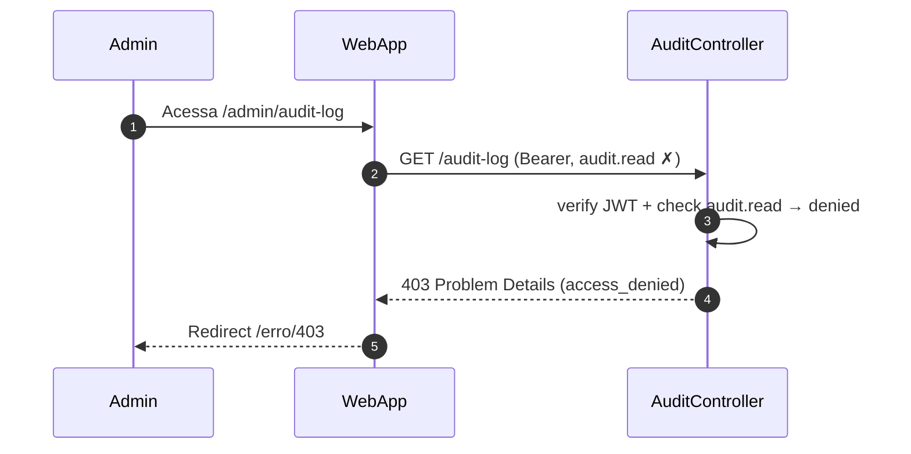

# US-F7-006 — Trilha de Auditoria

| Campo | Valor |
|-------|-------|
| **HU** | US-F7-006 |
| **Tela** | F7.7 — Audit Log |
| **Capability** | `audit.read` |
| **API primária** | `GET /audit-log` |
| **Fonte** | `fluxos_por_perfil.md` §8.5 · `US-F7-006-AUDIT-LOG.md` |

---

## Matriz de cobertura

| ID diagrama | Origem (CA/RN) | Classe | Status |
|-------------|----------------|--------|--------|
| F7.7-D01 | CA-01 · RN-01..04 · RN-09 · RN-10 | SEQUENCIA | gerado |
| F7.7-ERRO-01 | CA-01 (403 FGAC) | ERRO | gerado |
| — | CA-02 — filtrar ator + ação | DRY → F7.7-D01 | mesmo `GET /audit-log` com parâmetros `ator` e `acao` adicionais |
| — | CA-03 — Drawer com diff | NAO_APLICAVEL | `payloadAntes`/`payloadDepois` incluídos na resposta D01; Drawer + `DS/AuditDiffViewer` são client-side |
| — | CA-04 — fechar Drawer (Esc) | NAO_APLICAVEL | UX client-side pura (focus trap + Esc handler) |
| — | CA-05 — imutabilidade | NAO_APLICAVEL | ausência de DELETE/PATCH: sem endpoints, sem botões — não há sequência a modelar |
| — | CA-06 — intervalo estendido | DRY → F7.7-D01 | mesmo GET com `&de=2021-01-01` explícito |
| — | RN-05..07 — Drawer, diff colors, focus trap | NAO_APLICAVEL | componentes e comportamentos 100% client-side |
| — | RN-08 — tabela somente leitura | NAO_APLICAVEL | ausência de `_links` de ação no DTO — comportamento HATEOAS capturado em D01 Notas |

---

## Referências DRY

| Ref | Destino | Motivo |
|-----|---------|--------|
| F7.7-ERRO-01 (403 padrão) | [`F7/US-F7-001-IAM-USUARIOS.md` F7.1-ERRO-01](US-F7-001-IAM-USUARIOS.md) | Mesmo padrão `@PreAuthorize` + RFC 7807 403 |
| Inserção de registros no `audit_log` | Todas as HUs de mutação do sistema (US-F7-001 D02/D03/D04, US-F7-002 D02/D04/D05, US-F7-003 D02/D03/D04, etc.) | Esta HU cobre apenas a **leitura** da trilha; inserção é responsabilidade do UseCase de cada domínio |
| Exportação do audit_log como CSV | [`F5/US-F5-010-EXPORTACOES.md`](../F5/US-F5-010-EXPORTACOES.md) | Requer capability `export.run` — fora do escopo desta HU |

---

## Fora de sequência

| Item | Motivo |
|------|--------|
| CA-03 — DS/Drawer com DS/AuditDiffViewer | `payloadAntes` e `payloadDepois` incluídos na resposta da lista; abertura do Drawer, diff side-by-side e cores semânticas são renderização client-side sem chamada backend adicional |
| CA-04 — fechar Drawer via Esc | Accessibility UX (focus trap + key handler) — 100% client-side |
| CA-05 — imutabilidade | Não há endpoint DELETE ou PATCH para `/audit-log`; ausência de botões garantida via HATEOAS (DTO sem `_links` de ação) |
| CA-06 — intervalo estendido | DRY → F7.7-D01 (mesmo GET com `&de=2021-01-01`) |
| Alertas automáticos por padrão suspeito | Fora de escopo |
| Purga/arquivamento pela UI | Fora de escopo |

---

## F7.7-D01 — Listar eventos de auditoria (happy path + filtros)

**Escopo:** happy path — admin acessa `/admin/audit-log`; API retorna página de eventos do último ano com payload completo (antes/depois) para uso no Drawer client-side  
**Atores:** Admin, WebApp, AuditController, ListAuditLogUseCase, Postgres  
**Pré-condições:** admin com `audit.read`

```mermaid
sequenceDiagram
    autonumber
    participant Admin
    participant WebApp
    participant AuditController
    participant ListAuditLogUC as ListAuditLogUseCase
    participant Postgres

    Admin->>WebApp: Acessa /admin/audit-log
    WebApp->>AuditController: GET /audit-log?de=<-1 year>&ate=today&page=0&size=50 (B…
    AuditController->>ListAuditLogUC: execute(AuditQuery{ator, acao, entidade, de, ate, page})
    ListAuditLogUC->>Postgres: SELECT audit_log BY filtros ORDER BY timestamp DESC LIM…
    Postgres-->>ListAuditLogUC: Page<AuditLogEntity> {payloadAntes, payloadDepois per row}
    ListAuditLogUC-->>AuditController: Page<AuditLogDto>
    AuditController-->>WebApp: 200 {…}
    WebApp-->>Admin: DS/DataTable somente leitura; clique na linha → DS/Draw…
```

**Notas:**
- `payloadAntes` e `payloadDepois` incluídos na resposta da lista — abertura do Drawer (CA-03) e diff rendering (RN-05..06) são client-side sem roundtrip adicional (→ NAO_APLICAVEL)
- Sem `_links` de ação por item — imutabilidade garantida pelo DTO (CA-05, RN-08)
- Filtros CA-02 (ator + ação) → DRY: mesmo endpoint com `&ator=João&acao=USER_DEACTIVATED`
- Intervalo estendido CA-06 (até 5 anos) → DRY: mesmo GET com `&de=2021-01-01` explícito; default = último ano (RN-09)
- Paginação 50/página, `ORDER BY timestamp DESC` (RN-10)

**Lacunas:** nenhuma

---

## F7.7-ERRO-01 — 403 FGAC: audit.read ausente

**Escopo:** erro — usuário sem `audit.read` tenta acessar `/admin/audit-log`  
**Atores:** Admin (sem permissão), WebApp, AuditController  
**Pré-condições:** token JWT válido; sem `audit.read` nas authorities



**Notas:**
- `@PreAuthorize("hasAuthority('audit.read')")` — Spring Security rejeita antes do use case
- DRY → [F7.1-ERRO-01](US-F7-001-IAM-USUARIOS.md) — padrão idêntico; capability `audit.read`
- `audit.read` é uma capability restrita: geralmente atribuída apenas ao perfil `ADMIN` (RN-01)

**Lacunas:** nenhuma
