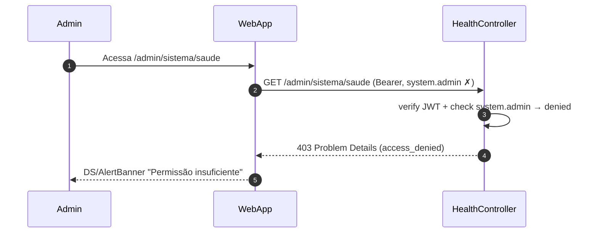

# US-F7-007 — Saúde do Sistema

| Campo | Valor |
|-------|-------|
| **HU** | US-F7-007 |
| **Tela** | F7.9 — Saúde do Sistema |
| **Capability** | `system.admin` |
| **API primária** | `GET /admin/sistema/saude` (agrega Actuator internamente) |
| **Fonte** | `fluxos_por_perfil.md` §8 · `US-F7-007-SAUDE-SISTEMA.md` |

> ⚠️ **P3 — extra-MVP.** Esta HU está fora do escopo do MVP. Os diagramas são gerados para completude da campanha e para orientar a implementação em iteração posterior.

---

## Matriz de cobertura

| ID diagrama | Origem (CA/RN) | Classe | Status |
|-------------|----------------|--------|--------|
| F7.9-D01 | CA-01 · RN-01..06 | SEQUENCIA | gerado |
| F7.9-ERRO-01 | CA-05 (403 FGAC) | ERRO | gerado |
| — | CA-02 — KPI fora do alvo | NAO_APLICAVEL | cor semântica client-side: valor vs. SLA target (RN-06) — sem chamada adicional |
| — | CA-03 — polling 30 s | DRY → F7.9-D01 | mesmo `GET /admin/sistema/saude` disparado pelo interval; `aria-live` é UX client-side |
| — | CA-04 — link Grafana | NAO_APLICAVEL | `window.open(GRAFANA_URL, '_blank')` — sem backend call; URL vem de env var (RN-07) |
| — | RN-08 — "não substitui Grafana" | NAO_APLICAVEL | observação arquitetural; sem impacto em sequência |

---

## Referências DRY

| Ref | Destino | Motivo |
|-----|---------|--------|
| F7.9-ERRO-01 (403 padrão) | [`F7/US-F7-001-IAM-USUARIOS.md` F7.1-ERRO-01](US-F7-001-IAM-USUARIOS.md) | Mesmo padrão `@PreAuthorize` + RFC 7807 403 |
| Outbox pending count | [`F7/US-F7-005-JOBS-OUTBOX.md` F7.6-D01](US-F7-005-JOBS-OUTBOX.md) | Mesmo dado (`outboxPending`) exibido em detalhe em F7.6-D01; aqui é KPI de resumo |

---

## Fora de sequência

| Item | Motivo |
|------|--------|
| CA-02 — cor status/danger para KPI violado | Comparação `valor > target` client-side com os dados de D01; zero backend call adicional |
| CA-03 — polling a cada 30 s | `setInterval(30_000)` no frontend redireciona para o mesmo GET de D01; `aria-live="polite"` é acessibilidade client-side |
| CA-04 — link "→ Abrir Grafana" | `window.open(GRAFANA_URL, '_blank', 'noopener,noreferrer')` — URL injetada via env var na build ou em resposta de configuração |
| Alertas automáticos (SMS/e-mail) | Fora de escopo |
| Histórico de séries temporais | Ver Grafana — fora de escopo desta HU |
| Logs de aplicação | Ver Loki no Grafana — fora de escopo |

---

## F7.9-D01 — Carregar KPIs de saúde do sistema (happy path)

**Escopo:** happy path — admin acessa `/admin/sistema/saude`; endpoint agrega 4 métricas do Spring Boot Actuator em paralelo e retorna summary DTO com indicadores SLA  
**Atores:** Admin, WebApp, HealthController, SystemHealthUseCase, ActuatorService  
**Pré-condições:** admin com `system.admin`; Spring Boot Actuator habilitado internamente

```mermaid
sequenceDiagram
    autonumber
    participant Admin
    participant WebApp
    participant HealthController
    participant SystemHealthUC as SystemHealthUseCase
    participant ActuatorService

    Admin->>WebApp: Acessa /admin/sistema/saude
    WebApp->>HealthController: GET /admin/sistema/saude (Bearer, system.admin ✓)
    HealthController->>SystemHealthUC: execute()
    SystemHealthUC->>ActuatorService: query p95 + outboxPending + 5xx(1h) + health (paralelo)
    ActuatorService-->>SystemHealthUC: {p95=240ms, outboxPending=3, errors5xx=0, uptime=99.9%}
    SystemHealthUC-->>HealthController: SystemHealthDto {kpis, slaViolations[]}
    HealthController-->>WebApp: 200 {…}
    WebApp-->>Admin: 4 KpiCards; cores semânticas por SLA; polling ativo a cada 30s
```

**Notas:**
- `ActuatorService` chama 4 endpoints em paralelo (internamente ao backend): `/actuator/metrics/http.server.requests?tag=quantile:0.95`, `/actuator/metrics/outbox.pending`, `/actuator/metrics/http.server.requests?tag=status:5xx&window=1h`, `/actuator/health` (RN-02)
- Actuator **não é exposto diretamente ao browser** — `HealthController` age como proxy interno; endpoint `/admin/sistema/saude` exige `system.admin`
- `slaViolations[]` na resposta lista quais KPIs excedem o alvo (ex.: `[{kpi:"p95", value:420, target:300}]`) — frontend usa isso para aplicar `status/danger` (CA-02 → NAO_APLICAVEL como sequência)
- Polling CA-03 → DRY: mesmo GET acionado por `setInterval(30_000)` no frontend; `aria-live="polite"` atualiza leitores de tela
- Link Grafana (CA-04) → URL de `GRAFANA_URL` env var, retornada opcionalmente em `meta.grafanaUrl` na resposta ou configurada em build-time

**Lacunas:** nenhuma

---

## F7.9-ERRO-01 — 403 FGAC: system.admin ausente

**Escopo:** erro — usuário com `system.observe` (mas sem `system.admin`) tenta acessar `/admin/sistema/saude`  
**Atores:** Admin (sem permissão), WebApp, HealthController  
**Pré-condições:** token JWT válido; tem `system.observe` mas não `system.admin`



**Notas:**
- `@PreAuthorize("hasAuthority('system.admin')")` — `system.observe` não é suficiente (CA-05)
- DRY → [F7.1-ERRO-01](US-F7-001-IAM-USUARIOS.md) — padrão idêntico; capability mais restrita que `system.observe`
- `system.admin` ⊃ `system.observe`: quem tem `system.admin` também pode acessar F7.6 (jobs) e F7.7 (audit-log); quem tem apenas `system.observe` não acessa esta tela

**Lacunas:** nenhuma
