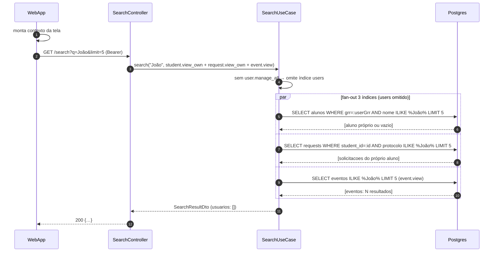

# US-F8-001 — Busca Global (Command Palette)

| HU | Tela | Capability | API primária | Fonte |
|----|------|------------|--------------|-------|
| US-F8-001 | F8.1 — Busca Global | Derivada do token JWT (sem capability fixa) | `GET /search?q=` | `HUs/F8 — Cross-cutting/US-F8-001-BUSCA-GLOBAL.md` |

---

## Matriz de cobertura

| ID diagrama | Origem (CA/RN) | Tipo | Status |
|-------------|----------------|------|--------|
| F8.1-D01 | CA-02, CA-03, RN-02, RN-03, RN-04, RN-05 | SEQUENCIA — happy path (debounce + fan-out + resultados) | gerado |
| F8.1-D02 | CA-04, RN-02, RN-11 | SEQUENCIA — FGAC fan-out (escopo por capability, perfil Aluno) | gerado |
| F8.1-D03 | CA-08, RN-09 (query sem correspondência) | SEQUENCIA — sem resultados (empty state pós-API) | gerado |
| F8.1-D04 | RN-10 | SEQUENCIA — timeout 5s no cliente (AbortController) | gerado |
| — | CA-01, RN-01 (abrir paleta Ctrl+K/⌘K) | NAO_APLICAVEL — evento de teclado puro; sem chamada de API | — |
| — | CA-05, RN-06 (navegação ↑/↓/Enter) | NAO_APLICAVEL — estado DOM; Enter = React Router navigation (client-side) | — |
| — | CA-06 (Esc fechar paleta) | NAO_APLICAVEL — DOM event; sem chamada de API | — |
| — | CA-07, RN-07, RN-08 (layout Desktop modal / Mobile tela cheia) | NAO_APLICAVEL — diferença de renderização UI; API idêntica ao happy path | — |
| — | RN-09 inicial (query vazia ou < 2 chars → EmptyState sem chamada) | NAO_APLICAVEL — estado inicial puramente client-side; sem chamada de API | — |

---

## Referências DRY

Nenhuma — US-F8-001 não replica fluxo de outra HU (busca cross-cutting é único no sistema).

---

## Fora de sequência

| Item | Motivo |
|------|--------|
| CA-01 — abrir paleta com `Ctrl+K` / `⌘K` | Listener de teclado em qualquer tela; sem I/O de rede; comportamento 100% client-side |
| CA-05 — navegação por teclado (↑/↓/Enter) | Gerenciamento de foco e índice de seleção no componente React; Enter dispara `navigate(item.href)` via React Router — não é uma chamada nova ao backend |
| CA-06 — fechar com `Esc` | `onKeyDown` fecha modal e restaura foco; sem chamada de API |
| CA-07 — Mobile tela cheia vs. modal Desktop | Layout condicional baseado em breakpoint (≥768px); a chamada `GET /search` é idêntica nos dois modos |
| RN-06 — dicas de atalho no rodapé (`Main/KeyboardHints`) | Componente estático decorativo |
| RN-07 — dimensões/posição do modal Desktop | CSS puro (max-width 640px, y=302px conforme Figma) |
| RN-08 — Mobile fullscreen header + botão Cancelar | Layout Expo Router / CSS; o botão "Cancelar" apenas faz `router.back()` |
| RN-09 inicial — estado Empty pré-digitação | Renderização condicional baseada em `query.length < 2`; não aciona debounce nem API |

---

## F8.1-D01 — Busca com debounce + fan-out paralelo + resultados agrupados (happy path)

**Escopo:** happy path — usuário digita ≥ 2 chars; API retorna resultados em pelo menos um índice  
**Atores:** Usuário autenticado (qualquer perfil), WebApp  
**Pré-condições:** JWT válido; pg_trgm habilitado em `students`, `requests`, `events`, `users`

```mermaid
sequenceDiagram
    autonumber
    participant Usuário
    participant WebApp
    participant SearchController
    participant SearchUseCase
    participant Postgres

    Usuário->>WebApp: digita "joão" no DS/CommandPalette (≥2 chars)
    WebApp->>WebApp: debounce 200ms; exibe skeleton Loading
    WebApp->>SearchController: GET /search?q=joão&limit=5 (Bearer)
    SearchController->>SearchUseCase: search("joão", capabilities)
    par fan-out paralelo — 4 índices
        SearchUseCase->>Postgres: SELECT alunos ILIKE %joão% LIMIT 5 (pg_trgm)
        Postgres-->>SearchUseCase: [alunos: 3 resultados]
    and
        SearchUseCase->>Postgres: SELECT requests ILIKE %joão% LIMIT 5 (filtrado por capabilities)
        Postgres-->>SearchUseCase: [solicitacoes: 2 resultados]
    and
        SearchUseCase->>Postgres: SELECT eventos ILIKE %joão% LIMIT 5 (pg_trgm)
        Postgres-->>SearchUseCase: [eventos: 1 resultado]
    and
        SearchUseCase->>Postgres: SELECT users ILIKE %joão% LIMIT 5 (apenas se user.manage_all)
        Postgres-->>SearchUseCase: [usuarios: 0 resultados]
    end
    SearchUseCase-->>SearchController: SearchResultDto (capability-scoped)
    SearchController-->>WebApp: 200 {alunos[3], solicitacoes[2], eventos[1], usuarios:[]}
    WebApp-->>Usuário: DS/SearchResultGroup agrupado por tipo
```

**Notas:**
- Passo 5–12: as 4 queries são executadas em paralelo dentro de `SearchUseCase`; cada uma aplica sua própria cláusula de capability antes de rodar (ver D02 para detalhe FGAC).
- O índice `users` só é consultado se o token carregar `user.manage_all`; caso contrário retorna `[]` sem tocar a tabela.
- `pg_trgm` (GIN) em `students.nome`, `events.titulo` viabiliza ILIKE eficiente; `requests` busca por número de protocolo e tipo.

**Lacunas:** nenhuma.

---

## F8.1-D02 — Fan-out FGAC: escopo por capability (perfil Aluno)

**Escopo:** mesma query `GET /search`, mas com token de **Aluno** — mostra como o SearchUseCase filtra cada índice pelas capabilities do token  
**Atores:** WebApp (Aluno autenticado)  
**Pré-condições:** JWT com `{student.view_own, request.view_own, event.view}` — sem `user.manage_all`



**Notas:**
- Passo 3 (self-call): SearchUseCase verifica `capabilities.contains("user.manage_all")` antes de montar o plano de queries — não precisa tocar o banco para saber que o índice `users` deve ser omitido.
- `student.view_own` restringe a WHERE com `grr = :userGrr` — o aluno nunca vê registros de outros alunos, mesmo que o nome coincida.
- `request.view_own` restringe a WHERE com `student_id = :userId` — o aluno só encontra suas próprias solicitações.
- O resultado `usuarios: []` não é erro — é comportamento esperado por design FGAC (RN-02, RN-11).

**Lacunas:** nenhuma.

---

## F8.1-D03 — Sem resultados encontrados (empty state pós-API)

**Escopo:** query válida (≥ 2 chars), porém nenhum índice retorna correspondência → estado EmptyState  
**Atores:** Usuário autenticado, WebApp  
**Pré-condições:** JWT válido; termo buscado sem correspondência em nenhuma tabela

```mermaid
sequenceDiagram
    autonumber
    participant Usuário
    participant WebApp
    participant SearchController
    participant SearchUseCase
    participant Postgres

    Usuário->>WebApp: digita "xyzxyz123" no input (≥2 chars)
    WebApp->>WebApp: debounce 200ms; exibe skeleton Loading
    WebApp->>SearchController: GET /search?q=xyzxyz123&limit=5 (Bearer)
    SearchController->>SearchUseCase: search("xyzxyz123", capabilities)
    SearchUseCase->>Postgres: fan-out paralelo 4 índices (pg_trgm)
    Postgres-->>SearchUseCase: [] em todos os índices (sem correspondência)
    SearchUseCase-->>SearchController: SearchResultDto (todos arrays vazios)
    SearchController-->>WebApp: 200 {alunos:[], solicitacoes:[], eventos:[], usuarios:[]}
    WebApp-->>Usuário: DS/EmptyState "Nenhum resultado para 'xyzxyz123'"
```

**Notas:**
- O fan-out (passo 5) segue o mesmo padrão de D01 (4 queries paralelas com capability filter); a diferença é exclusivamente no retorno do banco.
- O status HTTP continua **200** (não 404) — ausência de resultados é uma resposta válida do endpoint de busca.
- RN-09 distingue dois estados Empty: (a) query < 2 chars — sem chamada de API (NAO_APLICAVEL); (b) query ≥ 2 chars com 200 vazio — este diagrama.

**Lacunas:** nenhuma.

---

## F8.1-D04 — Timeout 5s no cliente (AbortController)

**Escopo:** erro de rede ou lentidão extrema — cliente cancela a requisição após 5s sem resposta  
**Atores:** Usuário autenticado, WebApp  
**Pré-condições:** JWT válido; rede instável ou backend sobrecarregado (> 5s de latência)

```mermaid
sequenceDiagram
    autonumber
    participant Usuário
    participant WebApp
    participant SearchController

    Usuário->>WebApp: digita "joão" no input (≥2 chars; debounce 200ms)
    WebApp->>SearchController: GET /search?q=joão&limit=5 (Bearer; timeout 5s)
    WebApp->>WebApp: 5s elapsed sem resposta → AbortController.abort()
    WebApp-->>Usuário: DS/EmptyState + mensagem de erro de rede
```

**Notas:**
- O timeout de 5s é responsabilidade do **cliente** (RN-10): `AbortController` com `signal.timeout(5000)` cancelando o `fetch`. O servidor pode continuar processando após o abort, mas a resposta é descartada.
- `SearchController` não aparece na resposta (passo 3) porque a conexão TCP é abortada pelo cliente antes de qualquer retorno — não há response body a processar.
- A mensagem de erro exibida pelo WebApp deve orientar o usuário a tentar novamente (não é erro 4xx/5xx do servidor).

**Lacunas:** nenhuma.
