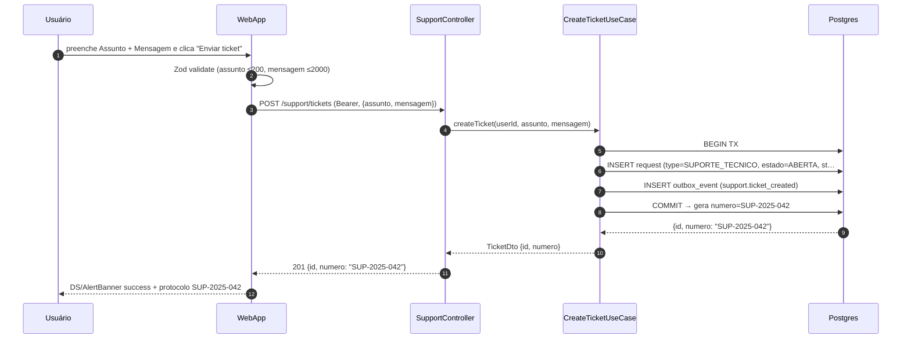
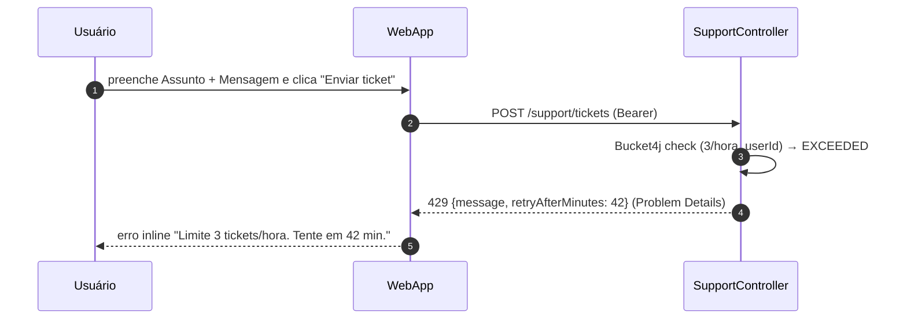

# US-F8-002 — Suporte e FAQ

| HU | Tela | Capability | API primária | Fonte |
|----|------|------------|--------------|-------|
| US-F8-002 | F8.2 — Suporte | `logado` (qualquer usuário autenticado) | `GET /support/faq` · `POST /support/tickets` | `HUs/F8 — Cross-cutting/US-F8-002-SUPORTE-FAQ.md` |

---

## Matriz de cobertura

| ID diagrama | Origem (CA/RN) | Tipo | Status |
|-------------|----------------|------|--------|
| F8.2-D01 | CA-01, RN-04, RN-12 | SEQUENCIA — FAQ carregamento dinâmico por perfil | gerado |
| F8.2-D02 | CA-03, RN-08, RN-09, RN-10 | SEQUENCIA — POST ticket + 201 + TX + outbox + protocolo | gerado |
| F8.2-D03 | CA-05, RN-11 | SEQUENCIA — rate limit 429 (Bucket4j) | gerado |
| — | RN-08 (WORKFLOW engine RequestType=SUPORTE_TECNICO) | DRY → `fluxos_por_perfil.md` §10.2 + `US-F7-003` (quando disponível) | DRY |
| — | Dispatch outbox (notificação secretaria) | DRY → `transversal/10.1-outbox-notificacao.md` | DRY |
| — | CA-02, RN-05 (navegação por teclado no Accordion) | NAO_APLICAVEL — interação DOM/ARIA; sem chamada de API | — |
| — | CA-04, RN-06 (validação frontend campos obrigatórios) | NAO_APLICAVEL — Zod client-side; API não é chamada | — |
| — | CA-06, RN-02, RN-03 (layout Desktop split / Mobile coluna única) | NAO_APLICAVEL — CSS responsivo; API idêntica nos dois modos | — |
| — | CA-07, RN-07 (link mailto fallback) | NAO_APLICAVEL — atributo href no anchor; sem chamada de API | — |

---

## Referências DRY

| Referência | Origem | Link |
|------------|--------|------|
| Workflow engine — RequestType=SUPORTE_TECNICO (RN-08) | `fluxos_por_perfil.md` §9.2: "registrado como `RequestType=SUPORTE_TECNICO` reutilizando o workflow engine (DRY total)" | `fluxos_por_perfil.md` §10.2 (state diagram); `sequenceDiagrams/F7/US-F7-003-WORKFLOW-ENGINE.md` (pendente) |
| Dispatch outbox → notificação secretaria | Após INSERT `outbox_event(support.ticket_created)` em D02, o `OutboxDispatcher` completa o envio | [`transversal/10.1-outbox-notificacao.md`](../transversal/10.1-outbox-notificacao.md) |

---

## Fora de sequência

| Item | Motivo |
|------|--------|
| CA-02 — navegação por teclado no FAQ (Tab/Enter/Space) | Gerenciamento de foco e `aria-expanded` no componente `DS/Accordion`; sem I/O de rede |
| CA-04 — campos obrigatórios (Assunto e Mensagem) | Zod schema client-side (`required`, `max: 200 / 2000`); o botão fica desabilitado e `POST` não é disparado |
| CA-06 — layout Mobile coluna única vs. Desktop split | Diferença de renderização CSS (media query ≥768px); `GET /support/faq` e `POST /support/tickets` idênticos nos dois modos |
| CA-07 — link `mailto:secretaria@ufpr.br` | Atributo `href="mailto:..."` no elemento `<a>`; sem chamada de API |
| RN-02/03 — dimensões `Main/SupportSplit` (556px × 2) | CSS puro; Figma frames `768:824` e `775:1074` |
| RN-05 — ARIA Accordion (`aria-expanded`, `role="region"`) | Acessibilidade semântica do componente; sem fluxo servidor |
| RN-06 — validação de tamanho máximo (assunto ≤200, mensagem ≤2000) | Também validada no servidor (422), mas o diagrama de erro de validação é simples (422 sem lógica backend específica) — coberto pelas notas de D02 |
| RN-07 — texto "Ou contate: secretaria@ufpr.br" | Link decorativo `mailto:`; sem chamada de API |

---

## F8.2-D01 — FAQ: carregamento dinâmico por perfil

**Escopo:** happy path — carregamento inicial da página `/suporte`; FAQ renderizado com perguntas ordenadas por perfil do usuário  
**Atores:** Usuário autenticado (qualquer perfil), WebApp  
**Pré-condições:** JWT válido; tabela `faq_items` populada pelo admin

```mermaid
sequenceDiagram
    autonumber
    participant Usuário
    participant WebApp
    participant SupportController
    participant SupportUseCase
    participant Postgres

    Usuário->>WebApp: navega para /suporte (Bearer; JwtFilter ✓)
    WebApp->>SupportController: GET /support/faq?perfil=ALUNO (Bearer)
    SupportController->>SupportUseCase: getFaq(perfil=ALUNO)
    SupportUseCase->>Postgres: SELECT faq_items WHERE ativa=true ORDER BY perfil_ordem…
    Postgres-->>SupportUseCase: [FaqItemDto] (ordenado por relevância de perfil)
    SupportUseCase-->>SupportController: List FaqItemDto
    SupportController-->>WebApp: 200 [{id, pergunta, resposta}]
    WebApp-->>Usuário: DS/Accordion (primeiro item expandido por padrão)
```

**Notas:**
- Passo 4: a ordenação por perfil é configurável pelo admin (RN-12); o parâmetro `?perfil=` espelha o claim `role` do JWT — o controller resolve o valor a partir do token, o usuário não o envia manualmente.
- FAQ é read-only para todos os perfis; gerenciamento dos itens fica fora do escopo F8 (admin via US-F7).
- O primeiro item é expandido por padrão (`defaultOpen: true`) no componente `DS/Accordion` — é uma decisão de UI, não uma flag da API.

**Lacunas:** nenhuma.

---

## F8.2-D02 — Enviar ticket com sucesso (POST + TX + outbox + protocolo)

**Escopo:** happy path — usuário submete ticket; backend cria request `SUPORTE_TECNICO` via workflow engine e insere evento outbox  
**Atores:** Usuário autenticado, WebApp  
**Pré-condições:** JWT válido; Zod client-side válido (campos preenchidos); `RequestType=SUPORTE_TECNICO` configurado no workflow engine (RN-08)



**Notas:**
- Passos 5–8: transação atômica — falha em qualquer INSERT faz rollback completo; o `outbox_event` garante que a notificação à secretaria será enviada mesmo em caso de falha pós-COMMIT.
- `RequestType=SUPORTE_TECNICO` reutiliza o workflow engine (RN-08, `fluxos` §9.2) — o ticket entra na fila de triagem da secretaria como qualquer outra solicitação. Alternativa MVP sem tipo configurado: INSERT direto em `support_thread`.
- Dispatch do outbox (notificação secretaria): **→ [transversal/10.1-outbox-notificacao.md](../transversal/10.1-outbox-notificacao.md)** (não redesenhar aqui).
- Formulário permanece visível após sucesso; apenas limpo (não navega) — comportamento client-side, sem nova chamada de API.

**Lacunas:** nenhuma.

---

## F8.2-D03 — Rate limit 429 (Bucket4j — 3 tickets/hora)

**Escopo:** erro — usuário tenta submeter quarto ticket na mesma hora; Bucket4j rejeita antes de tocar o banco  
**Atores:** Usuário autenticado, WebApp  
**Pré-condições:** JWT válido; usuário já enviou 3 tickets na última hora



**Notas:**
- Passo 3: o Bucket4j intercepta **antes** de qualquer lógica de negócio — nem `CreateTicketUseCase` nem Postgres são tocados (RN-11).
- O header `Retry-After` (RFC 7807 + RFC 6585) acompanha o 429; o frontend lê `retryAfterMinutes` do body para exibir o countdown de X min.
- Rate limiting é por `userId` (não por IP) para evitar bloqueio de NAT compartilhado.

**Lacunas:** nenhuma.
