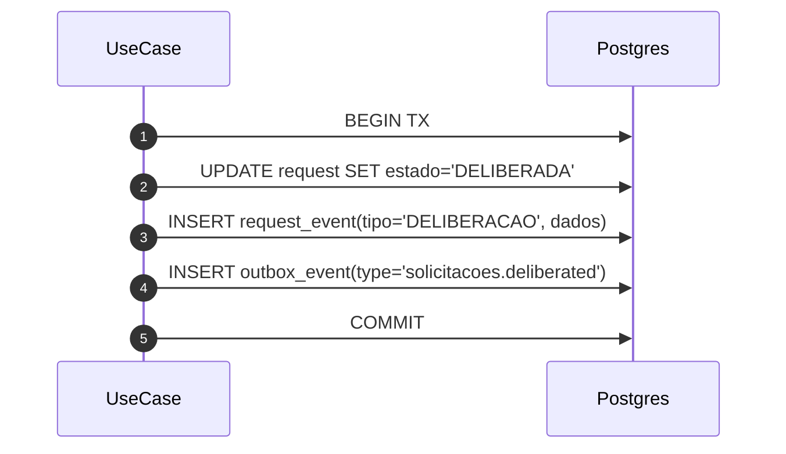
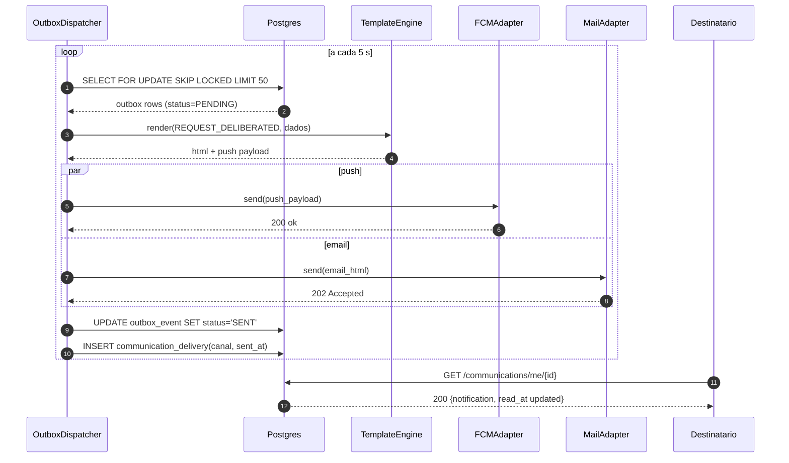

# 10.1 — Outbox: Notificação Ponta-a-Ponta

| ID | Fluxo origem | Tipo | Fonte |
|----|-------------|------|-------|
| 10.1 | `fluxos_por_perfil.md` §10.1 | Transversal async | §10.1 — Fluxo de notificação ponta-a-ponta |

## Matriz de cobertura

| ID diagrama | Origem | Tipo | Status |
|-------------|--------|------|--------|
| 10.1a | §10.1 — Fase TX (commit atômico com outbox) | SEQUENCIA | gerado |
| 10.1b | §10.1 — Fase Dispatch + Notificação ao destinatário | SEQUENCIA | gerado |

## Referências DRY

- HUs com tag `OUTBOX`: desenhar apenas a Fase TX local → link `transversal/10.1-outbox-notificacao.md` (10.1b) para o dispatch completo.
- Exemplos de HUs que referenciam este transversal: US-F0-002, US-F3-003, US-F3-004, US-F3-007.

## Fora de sequência

- §10.2 (ciclo de vida da solicitação) e §10.3 (ciclo de vida do evento de presença) são `stateDiagram-v2` — não gerados como `sequenceDiagram`.

---

## 10.1a — Fase TX: commit atômico com outbox (happy path)

**Escopo:** Use Case persiste mutação de negócio e enfileira evento no outbox em única transação atômica.
**Atores:** UseCase, Postgres
**Pré-condições:** JWT válido; capability FGAC verificada antes deste ponto; conexão com Postgres disponível.

**Notas:**
- Passos 1–5: transação única — se qualquer operação falhar, o COMMIT não ocorre e o evento não é enfileirado (consistência garantida sem mensageria externa).
- `UseCase` é genérico: substitua por `DeliberateRequestUC`, `ApproveFormativaUC`, `ConcluirEventoUC`, etc. — o padrão de commit atômico é idêntico em todos.
- O dispatch assíncrono do outbox_event é mostrado no diagrama 10.1b (abaixo).

**Lacunas:** nenhuma.

---

## 10.1b — Fase Dispatch: OutboxDispatcher + envio multicanal (happy path)

**Escopo:** Scheduler (`@Scheduled(fixedDelay=5000)`) drena a fila outbox e envia push + email ao destinatário; destinatário marca notificação como lida.
**Atores:** OutboxDispatcher, Postgres, TemplateEngine, FCMAdapter, MailAdapter, Destinatario
**Pré-condições:** `outbox_event` com `status=PENDING` existe (gerado em 10.1a); templates de notificação cadastrados; tokens FCM registrados.

**Notas:**
- `SELECT FOR UPDATE SKIP LOCKED`: garante que múltiplas instâncias do dispatcher não processem o mesmo evento — idempotência horizontal sem coordenação externa.
- `par push / and email`: canais enviados em paralelo; falha em um canal não bloqueia o outro — cada adapter tem retry próprio com backoff exponencial.
- SLA alvo: fila drenada em < 30 s da transição; Grafana alerta `outbox.dispatch_lag` > 5 min (ver `fluxos` §11).
- O template `REQUEST_DELIBERATED` é genérico: o `event_type` no outbox determina qual template o `TemplateEngine` seleciona.

**Lacunas:** nenhuma.
