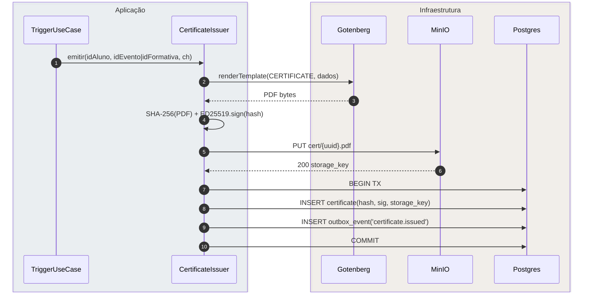

# 10.4 — Ciclo de Vida de um Certificado

| ID | Fluxo origem | Tipo | Fonte |
|----|-------------|------|-------|
| 10.4 | `fluxos_por_perfil.md` §10.4 | Transversal async | §10.4 — Ciclo de vida de um certificado |

## Matriz de cobertura

| ID diagrama | Origem | Tipo | Status |
|-------------|--------|------|--------|
| 10.4a | §10.4 — Emissão: render + assinar + persistir + outbox | SEQUENCIA | gerado |

## Referências DRY

- HUs com tag `CERT`: desenhar apenas a fase local (download, reemissão, verificação) → link `transversal/10.4-certificado-emissao.md` (10.4a) para a emissão completa.
- Dispatch da notificação `certificate.issued`: ver `transversal/10.1-outbox-notificacao.md` (10.1b) — mesmo padrão outbox.
- Exemplos de HUs que referenciam este transversal: US-F1-006 (formativas), US-F1-009 (presença), US-F1-010 (certificados), US-F0-007 (verificação pública), US-F3-004 (revisar formativas).

## Fora de sequência

- Verificação pública (`GET /publico/verificar-certificado/{hash}`) é fluxo do usuário externo sem JWT — cobre US-F0-007; não duplicar aqui.
- §10.3 (ciclo de vida do evento de presença) é `stateDiagram-v2` — não gerado como `sequenceDiagram`.

---

## 10.4a — Emissão de Certificado (happy path)

**Escopo:** Sistema gera certificado auditado ao detectar presença válida ou atividade formativa aprovada: render PDF → hash SHA-256 → assinar ED25519 → armazenar MinIO → persistir + outbox em TX atômica.
**Atores:** TriggerUseCase, CertificateIssuer, Gotenberg, MinIO, Postgres
**Pré-condições:** presença `status=VALID` ou formativa `estado=APROVADA`; nenhum certificado anterior para o mesmo par (aluno, evento|formativa); chave ED25519 carregada em memória.

**Notas:**
- Passo 4 (merged self-call): SHA-256 e ED25519 são operações em memória — sem I/O. Merged por regra de layout (SKILL: ≤ 1 self-call por diagrama).
- Passos 5–6: upload MinIO ocorre **antes** da TX — objeto sem registro é limpo por job periódico (TTL-based cleanup); objeto com registro é o certificado válido.
- Passos 7–10: TX atômica — `certificate` e `outbox_event` inseridos juntos; se o COMMIT falhar, nenhum certificado é registrado e o outbox não é enfileirado.
- Dispatch da notificação ao aluno: `OutboxDispatcher` processa `certificate.issued` → ver `transversal/10.1-outbox-notificacao.md` (10.1b).
- Verificação pública: `GET /publico/verificar-certificado/{hash}` valida `sig` com chave pública em `/.well-known/jwks.json` (ED25519, sem login). SLA emissão < 60 s (Grafana: `cert.issue.duration`).

**Lacunas:** nenhuma.
