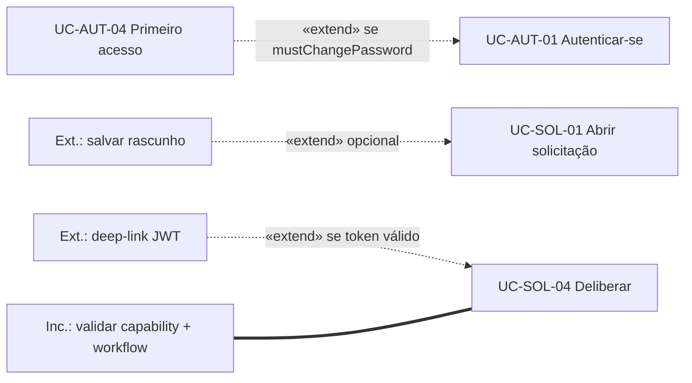

# Casos de Uso — SecretariaOnline2

**Versão:** 1.2 (diagrama de casos de uso **completado** com UC-PUB-01, atores S1–S5 na vista PlantUML e correções de associação face ao catálogo §5)  
**Escopo:** aplicação web e mobile descrita em `telas.md`, `fluxos_por_perfil.md`, `endpoints_canonicos_presenca_eventos_v4.md`, `jpaInterfaces_PostgresEntities.md` e `analise_arquitetural_secretariaonline2.md`. **Diagrama UML fonte:** `diagrama_casos_de_uso_secretariaonline2.puml` (PlantUML; três páginas: módulos, sistemas externos, include/extend).  
**Observação:** autorização opera por **capabilities** (FGAC) e telas são **cegas a perfil**; os atores abaixo agrupam papéis de negócio. Um mesmo usuário pode acumular capacidades (ex.: professor membro de CAAF).

## Legenda de siglas e abreviações

Siglas, acrônimos e identificadores recorrentes neste documento (texto, tabelas e diagramas). Quando a forma estendida já foi usada no corpo, o sentido aqui serve como referência rápida.

| Sigla / abrev. | Significado |
|:---------------|:------------|
| **A1–A9** | Identificadores dos **atores primários** humanos (§2.1). |
| **Ack** | *Acknowledgment* — reconhecimento de leitura ou ciência (ex.: ciência de atendimento). |
| **API** | *Application Programming Interface* — interface de software; nas referências cruzadas, contratos REST/OpenAPI. |
| **BFF** | *Backend for Frontend* — camada que agrega dados para o cliente (ex.: *dashboard* contextual). |
| **CAAF** | Comissão de Atividades Formativas Acadêmicas — colegiado que revisa formativas. |
| **COE** | Comissão de Estágio (órgão colegiado de estágio no desenho). |
| **CRUD** | *Create, Read, Update, Delete* — ciclo completo de persistência sobre um recurso. |
| **CSV** | *Comma-separated Values* — dados em texto colunar separado por vírgula. |
| **DND** | *Do Not Disturb* — “não perturbar” nas preferências de notificação. |
| **DRY** | *Don't Repeat Yourself* — evitar duplicação desnecessária de lógicas ou artefatos. |
| **ED25519** | Esquema de assinatura digital (RFC 8032), citado na verificação pública de certificados. |
| **ER** | Modelo **entidade–relacionamento**. |
| **FAQ** | *Frequently Asked Questions* — perguntas frequentes. |
| **FGAC** | *Fine-Grained Access Control* — controle de acesso fino por *capabilities*/autoridades. |
| **GET / POST / …** | Verbos do protocolo **HTTP** em rotas REST (ex.: `GET /request-types/{code}`). |
| **GPS** | *Global Positioning System* — no desenho de presença, **não** se usa GPS. |
| **HATEOAS** | *Hypermedia as the Engine of Application State* — respostas com `_links` e ações disponíveis. |
| **HTTP** | *Hypertext Transfer Protocol*. |
| **IAM** | *Identity and Access Management* — identidade e gestão de acessos. |
| **JSON** | *JavaScript Object Notation* — formato de dados (ex.: `workflow_json`). |
| **JPA** | *Java Persistence API* — mapeamento objeto–relacional no backend Java. |
| **JWT** | *JSON Web Token* — token assinado (sessão, redefinição de senha ou *deep-link* de uso único). |
| **JWKS** | *JSON Web Key Set* — conjunto de chaves públicas para validação de assinaturas. |
| **LGPD** | Lei Geral de Proteção de Dados Pessoais (Lei nº 13.709/2018). |
| **MFA** | *Multi-Factor Authentication* — autenticação multifator (mencionada como evolução em tela). |
| **Mermaid** | Sintaxe de diagramas embutidos em Markdown (fluxos deste documento). |
| **MVP** | *Minimum Viable Product* — produto mínimo viável. |
| **OIDC** | *OpenID Connect* — identidade federada sobre OAuth 2 (citado como extensão futura). |
| **OpenAPI** | Especificação das APIs REST (contrato versionado referenciado na documentação do desenho). |
| **Outbox** | Padrão de **caixa de saída transacional** para mensagens/notificações consistentes com o banco. |
| **PDF** | *Portable Document Format*. |
| **PIN** | *Personal Identification Number* — segredo numérico ou alfanumérico nos modos `SECRET_*` da presença v4.1. |
| **P0 / P1 / P2** | Níveis de **prioridade** dos casos de uso (§5): P0 essencial ao MVP; P1 alto valor; P2 avançado ou opcional. |
| **PoS** | *Proof of Stay* — prova de permanência auditável em eventos. |
| **QR** | Código *Quick Response* — em **protocolos/certificados** (verificação pública) e, **no módulo de presença v4.1**, nos modos `QR_*` de validação de evento. |
| **REST** | *Representational State Transfer* — estilo de API sobre HTTP. |
| **S1–S6** | Identificadores dos **atores secundários** (sistemas ou verificador externo) na §2.2. |
| **SAML** | *Security Assertion Markup Language* — federação de identidade (SSO opcional). |
| **SHA-256** | Função *hash* de 256 bits para verificação de integridade de arquivos públicos. |
| **SLA** | *Service Level Agreement* — acordo ou meta de nível de serviço (prazos operacionais). |
| **SSO** | *Single Sign-On* — login único institucional. |
| **TCC** | Trabalho de Conclusão de Curso. |
| **UC** | *Use Case* — caso de uso; prefixo **UC-** nos identificadores (ex.: `UC-SOL-01`). |
| **UC-PUB-*** | Casos de uso de **conteúdo público** (pré-login), ex.: institucional e erro. |
| **UML** | *Unified Modeling Language*. |
| **URL** | *Uniform Resource Locator* — endereço web (ex.: *deep-link* com `?token=`). |
| **UUID** | *Universally Unique Identifier* — identificador único (ex.: `deviceUuid` na presença). |
| **XLSX** | Formato de planilha Microsoft Excel (Open XML). |

---

## 1. Visão geral

O **SecretariaOnline2** digitaliza a relação entre estudantes, docentes, comissões, secretaria acadêmica, coordenação e administração com foco em **solicitações genéricas** (motor de workflow), **comunicação transacional** (Hub + *Outbox*), **formativas**, **estágio**, **TCC**, **presença auditável em eventos/palestras** e **certificados com verificação pública**.

Este documento consolida **casos de uso** com **atores**, **associações**, relações de **inclusão/extensão** (como na UML, descritas em texto e refletidas em diagrama), rastreio para **telas** e **fluxos**, e registro explícito de **premissas e lacunas**.

---

## 2. Atores

### 2.1 Atores primários (humanos)

| ID | Ator | Descrição |
|----|------|-----------|
| **A1** | **Visitante** | Usuário não autenticado que acessa rotas públicas. |
| **A2** | **Aluno** | Estudante com *role* equivalente a matrícula ativa; consome dashboard, solicitações, formativas, estágio, TCC, eventos, certificados, comunicação e atendimentos. |
| **A3** | **Egresso** | Ex-aluno após colação/diploma; visão predominantemente *read-only* e certificados. |
| **A4** | **Professor** | Docente com deliberação, orientação, publicação de comunicados de turma e, quando aplicável, **organização de evento** (`event.host`). |
| **A5** | **Membro CAAF** | Subconjunto de professores com `formative.review` e escopo de curso; revisão de horas complementares. |
| **A6** | **Membro COE** | Subconjunto com `internship.review`; pareceres e gestão em lote de estágio. |
| **A7** | **Secretaria** | Operador acadêmico: filas, cadastros, importações/exportações, eventos, diplomas, atendimentos. |
| **A8** | **Coordenador** | Secretaria **mais** configuração de curso e relatórios analíticos (`course.config`, `report.view_coordinator`). |
| **A9** | **Administrador da plataforma** | Gestão global de IAM (`user.manage_all`, `iam.manage_*`, `request_type.manage`, *Outbox*, auditoria). |

### 2.2 Atores secundários

| ID | Ator | Descrição |
|----|------|-----------|
| **S1** | **Sistema de autenticação / IAM** | Emite JWT, valida sessão, aplica bloqueio por tentativas, *refresh* rotativo. |
| **S2** | **Sistema de notificação (*Hub* + *Outbox*)** | Encaminha e-mail, push e entregas in-app conforme política e preferências. |
| **S3** | **Motor de workflow de solicitações** | Interpreta `RequestType.workflow_json`, transições, *guards* e HATEOAS. |
| **S4** | **Emissor de certificados** | Gera PDF, hash, assinatura; dispara eventos de emissão (vide `fluxos_por_perfil.md` §F1.6). |
| **S5** | **Armazenamento de objetos** | Object storage (ex.: MinIO/S3) para anexos e PDFs. |
| **S6** | **Verificador externo** | Pessoa ou instituição que valida protocolo ou certificado **sem** credencial no sistema (rotas públicas). |

---

## 3. Diagrama do modelo de casos de uso (visão por módulo)

O diagrama abaixo organiza **subsistemas** (*bounded contexts* da análise arquitetural) e liga **atores primários** às fronteiras onde interagem. Os identificadores **UC-xxx** correspondem à tabela da §5.

**Fonte editável e exportação (recomendado):** `diagrama_casos_de_uso_secretariaonline2.puml` — inclui **S1–S5** (página dedicada), **UC-PUB-01** e associações alinhadas ao catálogo §5 (ex.: **UC-FOR-03** apenas **A5**; **UC-COM-01** também **A4** e **A8**; **UC-PRE-04** para **A4** e **A7**; **UC-ADM-12** para **A7**). O Mermaid aqui espelha a mesma topologia para leitura em GitHub/preview.

```mermaid
flowchart TB
  subgraph Atores["Atores (primários e verificador externo)"]
    A1[Visitante]
    A2[Aluno]
    A3[Egresso]
    A4[Professor]
    A5[CAAF]
    A6[COE]
    A7[Secretaria]
    A8[Coordenador]
    A9[Admin plataforma]
    S6[S6 Verificador externo]
  end

  subgraph M_PUB["Módulo: Conteúdo público"]
    UC_PUB01["UC-PUB-01 Página institucional / erro"]
  end

  subgraph M_DASH["Módulo: Dashboards"]
    UC_DASH["UC-DASH-01 Visualizar dashboard contextual"]
  end

  subgraph M_IAM["Módulo: Identidade e acesso"]
    UC_A01["UC-AUT-01 Autenticar-se"]
    UC_A02["UC-AUT-02 Recuperar senha"]
    UC_A03["UC-AUT-03 Redefinir senha"]
    UC_A04["UC-AUT-04 Completar primeiro acesso"]
    UC_A05["UC-AUT-05 Gerenciar perfil e segurança"]
    UC_A06["UC-AUT-06 Configurar preferências de notificação"]
  end

  subgraph M_SOL["Módulo: Solicitações / workflow"]
    UC_S01["UC-SOL-01 Abrir solicitação"]
    UC_S02["UC-SOL-02 Abrir solicitação interna"]
    UC_S03["UC-SOL-03 Acompanhar solicitação"]
    UC_S04["UC-SOL-04 Deliberar solicitação"]
    UC_S05["UC-SOL-05 Gerar protocolo PDF"]
    UC_S06["UC-SOL-06 Triar e gerenciar fila de solicitações"]
    UC_S07["UC-SOL-07 Revisar autorização de imagem em lote"]
  end

  subgraph M_FOR["Módulo: Formativas"]
    UC_F01["UC-FOR-01 Submeter formativa"]
    UC_F02["UC-FOR-02 Acompanhar formativa"]
    UC_F03["UC-FOR-03 Revisar / aprovar formativa (só CAAF)"]
    UC_F04["UC-FOR-04 Painel comissão CAAF"]
  end

  subgraph M_EST["Módulo: Estágio"]
    UC_E01["UC-EST-01 Gerenciar estágio como aluno"]
    UC_E02["UC-EST-02 Orientar / parecer estágio"]
    UC_E03["UC-EST-03 Painel comissão COE"]
  end

  subgraph M_TCC["Módulo: TCC"]
    UC_T01["UC-TCC-01 Gerenciar TCC como aluno"]
    UC_T02["UC-TCC-02 Orientar / examinar TCC"]
  end

  subgraph M_PRES["Módulo: Presença em eventos v4.1"]
    UC_P01["UC-PRE-01 Cadastrar / gestão CRUD de eventos"]
    UC_P02["UC-PRE-02 Operar validação no evento (QR/PIN, janelas)"]
    UC_P03["UC-PRE-03 Confirmar presença (modo configurável)"]
    UC_P04["UC-PRE-04 Encerrar evento e disparar regras"]
  end

  subgraph M_COM["Módulo: Comunicação"]
    UC_C01["UC-COM-01 Consumir hub de comunicação"]
    UC_C02["UC-COM-02 Publicar comunicado de turma"]
    UC_C03["UC-COM-03 Administrar templates de comunicação"]
  end

  subgraph M_ACAD["Módulo: Cadastro acadêmico"]
    UC_D01["UC-CAD-01 CRUD alunos"]
    UC_D02["UC-CAD-02 CRUD cursos e secretários vinculados"]
    UC_D03["UC-CAD-03 CRUD disciplinas"]
    UC_D04["UC-CAD-04 CRUD períodos e calendário acadêmico"]
    UC_D05["UC-CAD-05 Configurar parâmetros do curso (coordenação)"]
  end

  subgraph M_DIP["Módulo: Egresso / diploma"]
    UC_G01["UC-EGR-01 Dashboard egresso"]
    UC_G02["UC-EGR-02 Registrar colação / diploma"]
    UC_G03["UC-EGR-03 Listar / exportar egressos"]
  end

  subgraph M_ATD["Módulo: Atendimento registrado"]
    UC_R01["UC-ATD-01 Registrar atendimento"]
    UC_R02["UC-ATD-02 Reconhecer ciência do atendimento"]
  end

  subgraph M_CERT["Módulo: Certificados e verificação pública"]
    UC_X01["UC-CRT-01 Listar / baixar certificados próprios"]
    UC_X02["UC-CRT-02 Verificar protocolo publicamente"]
    UC_X03["UC-CRT-03 Verificar certificado publicamente"]
  end

  subgraph M_ADM["Módulo: Administração e operação"]
    UC_M01["UC-ADM-01 CRUD usuários global"]
    UC_M02["UC-ADM-02 CRUD perfis e autoridades (FGAC)"]
    UC_M03["UC-ADM-03 CRUD tipos de solicitação (workflow)"]
    UC_M04["UC-ADM-04 Monitorar Outbox e jobs agendados"]
    UC_M05["UC-ADM-05 Pesquisar audit log"]
    UC_M06["UC-ADM-06 Importar planilhas"]
    UC_M07["UC-ADM-07 Exportar relatórios"]
    UC_M08["UC-ADM-08 Estatísticas secretaria"]
    UC_M09["UC-ADM-09 Relatórios coordenação"]
    UC_M10["UC-ADM-10 Busca global"]
    UC_M11["UC-ADM-11 Suporte / FAQ"]
    UC_M12["UC-ADM-12 Tarefas internas (opcional)"]
  end

  A1 --> UC_PUB01
  A1 --> UC_A01
  A1 --> UC_A02
  A1 --> UC_A03
  A1 --> UC_X02
  A1 --> UC_X03

  A2 --> UC_A01
  A3 --> UC_A01
  A4 --> UC_A01
  A5 --> UC_A01
  A6 --> UC_A01
  A7 --> UC_A01
  A8 --> UC_A01
  A9 --> UC_A01

  A2 --> UC_A04
  A2 --> UC_A05
  A2 --> UC_A06
  A3 --> UC_A05
  A4 --> UC_A05
  A5 --> UC_A05
  A6 --> UC_A05
  A7 --> UC_A05
  A8 --> UC_A05
  A9 --> UC_A05

  A3 --> UC_A06
  A4 --> UC_A06
  A5 --> UC_A06
  A6 --> UC_A06
  A7 --> UC_A06
  A8 --> UC_A06
  A9 --> UC_A06

  A2 --> UC_S01
  A2 --> UC_S03
  A2 --> UC_S05
  A2 --> UC_F01
  A2 --> UC_F02
  A2 --> UC_E01
  A2 --> UC_T01
  A2 --> UC_P03
  A2 --> UC_C01
  A2 --> UC_R02
  A2 --> UC_X01

  A3 --> UC_G01
  A3 --> UC_X01
  A3 --> UC_A05

  A4 --> UC_S04
  A4 --> UC_S03
  A4 --> UC_P01
  A4 --> UC_P02
  A4 --> UC_P04
  A4 --> UC_C02
  A4 --> UC_C01
  A4 --> UC_E02
  A4 --> UC_T02

  A5 --> UC_F04
  A5 --> UC_F03
  A5 --> UC_S03
  A6 --> UC_E03
  A6 --> UC_E02

  A7 --> UC_S02
  A7 --> UC_S04
  A7 --> UC_S03
  A7 --> UC_S06
  A7 --> UC_S07
  A7 --> UC_D01
  A7 --> UC_D02
  A7 --> UC_D03
  A7 --> UC_D04
  A7 --> UC_P01
  A7 --> UC_P02
  A7 --> UC_P04
  A7 --> UC_R01
  A7 --> UC_G02
  A7 --> UC_G03
  A7 --> UC_M06
  A7 --> UC_M07
  A7 --> UC_M08
  A7 --> UC_C01
  A7 --> UC_M12

  A9 --> UC_P01
  A9 --> UC_P04

  A8 --> UC_D05
  A8 --> UC_D04
  A8 --> UC_M09
  A8 --> UC_S06
  A8 --> UC_S04
  A8 --> UC_P02
  A8 --> UC_C01

  A9 --> UC_M01
  A9 --> UC_M02
  A9 --> UC_M03
  A9 --> UC_C03
  A9 --> UC_M04
  A9 --> UC_M05

  A2 --> UC_DASH
  A4 --> UC_DASH
  A7 --> UC_DASH
  A8 --> UC_DASH

  A2 --> UC_M10
  A4 --> UC_M10
  A7 --> UC_M10
  A8 --> UC_M10
  A2 --> UC_M11
  A4 --> UC_M11
  A7 --> UC_M11
  A8 --> UC_M11

  S6 --> UC_X02
  S6 --> UC_X03
```

---

## 4. Relações `<<include>>` e `<<extend>>`

A UML clássica diferencia:

- **`<<include>>`**: comportamento **obrigatório** reutilizado (o caso base não se completa sem ele).
- **`<<extend>>`**: comportamento **condicional/ opcional** que acrescenta o caso base quando um *guard* é verdadeiro.

Como o Mermaid não expressa perfeitamente *stereotypes* UML em diagramas de caso de uso, as relações abaixo estão **descritas** e **esboçadas** em diagrama com legenda equivalente.

### 4.1 Includes obrigatórios (resumo)

| Caso base | Inclui (sempre ou em toda mutação autenticada) | Justificativa |
|-----------|-----------------------------------------------|---------------|
| UC-SOL-01, UC-SOL-02, UC-SOL-04, UC-F01, UC-P03, … | **Validar sessão e autoridade** (*include* lógico de UC-AUT-01) | Toda operação autenticada depende de JWT/capability. |
| UC-SOL-01, UC-SOL-02 | **Obter `RequestType` e schema** | Wizard depende de `GET /request-types/{code}` (`telas.md` F1.8 / F5.3). |
| UC-SOL-04 | **Validar transição no workflow** | Motor S3 + `POST /requests/{id}/transitions` (`fluxos_por_perfil.md` F3.3). |
| UC-SOL-04, UC-F03, UC-P02, UC-G02, … | **Registrar auditoria / evento de domínio** | Política da análise arquitetural §4.6 / `request_event`, `audit_log`. |
| Deliberações e transições que notificam | **Enfileirar `outbox_event`** | Padrão *Outbox* (`analise_arquitetural_secretariaonline2.md` §9). |

### 4.2 Extensões condicionais (resumo)

| Ponto de extensão | Estende | Condição (*guard*) |
|-------------------|---------|---------------------|
| UC-AUT-01 Autenticar-se | **UC-AUT-04 Completar primeiro acesso** | Resposta com `mustChangePassword=true` (`telas.md` F1.2, `fluxos_por_perfil.md` F1.1). |
| UC-SOL-01 Abrir solicitação | **Persistir rascunho** | Aluno/secretaria opta por salvar antes de confirmar (`fluxos_por_perfil.md` F1.2 *sub-fluxo Rascunho*). |
| UC-SOL-03 / UC-SOL-04 | **Abrir deliberação via *deep-link* (JWT 1-uso)** | URL com `?token=` válido; preview antes do login completo (`fluxos_por_perfil.md` F3.3). |
| UC-PRE-03 Confirmar presença | **Entrada** vs **saída** vs **QR** | HATEOAS + `attendanceMode` (`endpoints_canonicos_presenca_eventos_v4.md` §8). |
| UC-FOR-01 | **Aceitar formativa pré-preenchida** | Atividade vinculada a evento com presença validada (`telas.md` F1.11, `fluxos_por_perfil.md` F1.4). |

### 4.3 Diagrama de includes/extends (legenda UML)

> **Legenda:** linha tracejada **«extend»**; linha forte **«include»** (aqui: *validar autorização/workflow* é parte obrigatória da deliberação).

---

## 5. Catálogo estruturado de casos de uso

**Prioridade:** **P0** essencial para MVP acadêmico; **P1** alto valor operacional; **P2** operação avançada ou opcional conforme documentação.

| ID | Nome | Ator(es) | Descrição breve | Pré-condições conhecidas | Referência principal (telas / fluxos) | Prio. |
|----|------|----------|-----------------|--------------------------|---------------------------------------|-------|
| UC-AUT-01 | Autenticar-se | A1→A2…A9 | Login com identificador/senha; emissão de tokens; *rate limit*. | Conta ativa; credenciais válidas. | `telas.md` F0.1; `fluxos_por_perfil.md` F0.1 | P0 |
| UC-AUT-02 | Recuperar senha | A1 | Solicita e-mail com link (resposta 202 anti-enumeration). | E-mail conhecido do sistema (ou não — mesmo retorno). | `telas.md` F0.2; `fluxos_por_perfil.md` F0.2 | P0 |
| UC-AUT-03 | Redefinir senha | A1 | Define nova senha a partir de JWT 1-uso; invalida sessões. | Token válido; política de senha. | `telas.md` F0.3; `fluxos_por_perfil.md` F0.2 | P0 |
| UC-AUT-04 | Completar primeiro acesso | A2 | Troca senha inicial + aceite LGPD; bloqueia demais rotas até concluir. | `mustChangePassword` ou equivalente. | `telas.md` F1.2; `fluxos_por_perfil.md` F1.1 | P0 |
| UC-AUT-05 | Gerenciar perfil e segurança | A2,A3,A4… | Dados pessoais; troca senha; encerrar sessões. | Autenticado. | `telas.md` F1.3–F1.4 | P0 |
| UC-AUT-06 | Configurar preferências de notificação | A2,A3… | Canais, DND, *digest*. | Autenticado. | `telas.md` F1.5; *lacuna L04 corrigida* | P1 |
| UC-CRT-02 | Verificar protocolo publicamente | A1,S6 | Consulta pública + *upload* opcional do PDF para SHA-256. | ID público existente. | `telas.md` F0.6; `fluxos_por_perfil.md` F0.3 | P0 |
| UC-CRT-03 | Verificar certificado publicamente | A1,S6 | Valida metadados + assinatura ED25519 (JWKS). | Hash/rota pública válida. | `telas.md` F0.7; `analise_arquitetural_secretariaonline2.md` §11 | P1 |
| UC-DASH-01 | Visualizar *dashboard* contextual | A2,A4,A7,A8 | Agregação BFF: pendências, SLAs, atalhos. | Autenticado; capability de *dashboard* correspondente. | `telas.md` F1.1, F3.1, F5.1; `fluxos_por_perfil.md` §2–6 | P0 |
| UC-COM-01 | Consumir hub de comunicação | A2,A4,A7,A8 | Lista filtros; marca leitura; *inbox* de atendimento. | Autenticado; `communication.read`. | `telas.md` F1.6; `fluxos_por_perfil.md` F1.9 | P0 |
| UC-COM-02 | Publicar comunicado de turma | A4 | Markdown + audiência + prioridade. | `communication.publish_class`. | `telas.md` F3.8; `fluxos_por_perfil.md` F3.7 | P1 |
| UC-COM-03 | Administrar templates | A9 | CRUD versionado de templates. | `communication.manage_templates`. | `telas.md` F7.5 | P1 |
| UC-SOL-01 | Abrir solicitação (*wizard*) | A2 | Três passos; anexos; confirmação; *Outbox*. | Tipo visível conforme curso e *guards*. | `telas.md` F1.8; `fluxos_por_perfil.md` F1.2 | P0 |
| UC-SOL-02 | Abrir solicitação interna | A7 | Mesmo *wizard* com campo “Em nome de”. | `request.internal_open`. | `telas.md` F5.3; `fluxos_por_perfil.md` F5.1 | P0 |
| UC-SOL-03 | Acompanhar solicitação | A2,A4,A5,A7 | Detalhe + *timeline* + ações HATEOAS. | Permissão de visão ou deliberação. | `telas.md` F1.9, F3.3–F3.4, F5.2; `fluxos_por_perfil.md` F1.3 | P0 |
| UC-SOL-04 | Deliberar solicitação | A4,A7,A8 | Transições: deferir, indeferir, ajustes, encaminhar. | Capabilities × `request_type`. | `telas.md` F3.4, F5.4; `fluxos_por_perfil.md` F3.3, F5.2 | P0 |
| UC-SOL-05 | Gerar protocolo PDF | A2 | PDF com QR para verificação pública. | Estado permite ação via `_links`. | `telas.md` F1.9; `fluxos_por_perfil.md` F1.3 | P0 |
| UC-SOL-06 | Triar fila de solicitações | A7,A8 | Filtros, *SLA*, ações em lote, export CSV. | `request.view_curso` ou similar. | `telas.md` F5.2, F5.5; `fluxos_por_perfil.md` F5.1, F5.3 | P0 |
| UC-SOL-07 | Revisar autorização de imagem | A7 | *DRY*: filtro sobre solicitações `AUTORIZACAO_IMAGEM`. | `image_authorization.review`. | `telas.md` F5.12 | P1 |
| UC-FOR-01 | Submeter formativa | A2 | Horas + comprovante ou fluxo pré-validado por evento. | `formative.submit`. | `telas.md` F1.11; `fluxos_por_perfil.md` F1.4 | P0 |
| UC-FOR-02 | Acompanhar formativa | A2 | Detalhe + parecer CAAF + certificado. | `formative.view_own`. | `telas.md` F1.10–F1.12 | P0 |
| UC-FOR-03 | Revisar formativa | A5 | Aprovar/rejeitar; lote para tipo evento interno. | `formative.review` **e** membro CAAF (escopo). | `telas.md` F3.5; `fluxos_por_perfil.md` F3.5 | P0 |
| UC-FOR-04 | Painel comissão CAAF | A5 | *Dashboard* consolidado + atribuição interna. | Escopo curso/comissão. | `telas.md` F4.1; `fluxos_por_perfil.md` F4 | P1 |
| UC-EST-01 | Gerenciar estágio (aluno) | A2 | Lista, *upload* de documentos. | `internship.view_own`, `internship.upload_doc_own`. | `telas.md` F1.13–F1.14 | P0 |
| UC-EST-02 | Orientar / parecer estágio | A4,A6 | Revisão documental; *close*. | `internship.supervise` / `internship.review`. | `telas.md` F3.6; `fluxos_por_perfil.md` F3.6 | P0 |
| UC-EST-03 | Painel COE | A6 | *Dashboard* + delegação. | Escopo comissão. | `telas.md` F4.2; `fluxos_por_perfil.md` F4 | P1 |
| UC-TCC-01 | Gerenciar TCC (aluno) | A2 | Equipe, banca, entrega final. | `tcc.view_own`, `tcc.upload_final`. | `telas.md` F1.15–F1.16 | P0 |
| UC-TCC-02 | Orientar / examinar TCC | A4 | Notas/pareceres. | `tcc.supervise` / `tcc.examine`. | `telas.md` F3.7; `fluxos_por_perfil.md` F3.7 | P0 |
| UC-PRE-01 | Cadastrar / gestão CRUD de eventos | A4,A7,A9 | CRUD; filtro **somente os meus**; leitura de eventos de terceiros sem mutação; `attendanceMode` e janelas. | `event.manage`. | `telas.md` F3.2, F5.14; `fluxos_por_perfil.md` F3.2, F5.8 | P1 |
| UC-PRE-02 | Operar validação no evento | A4,A7,A8 | Janelas, QR/PIN conforme modo; contadores. | `event.host` ou `event.manage`. | `telas.md` F3.2, F5.15; `endpoints_canonicos_presenca_eventos_v4.md` §4 | P1 |
| UC-PRE-03 | Confirmar presença (aluno) | A2 | PIN/senha ou QR + `deviceUuid` quando aplicável; janelas configuráveis; UI cega em 403. | `attendance.check_in`; *links* HATEOAS ativos. | `telas.md` F1.17–F1.18; `fluxos_por_perfil.md` F1.7 | P1 |
| UC-PRE-04 | Encerrar evento | A4,A7,A9 | Dispara certificado/formativa automatizados. | Política de encerramento. | `endpoints_canonicos_presenca_eventos_v4.md` §6; `fluxos_por_perfil.md` F3.2 | P1 |
| UC-CRT-01 | Listar/baixar certificados próprios | A2,A3 | PDF assinado + QR. | `certificate.view_own`. | `telas.md` F1.19, F2.1; `fluxos_por_perfil.md` F1.6, F2.1 | P1 |
| UC-ATD-01 | Registrar atendimento | A7 | Cria registro; notifica aluno via *Outbox*. | `service_record.create`. | `telas.md` F5.13; `fluxos_por_perfil.md` F5.6 | P0 |
| UC-ATD-02 | Dar ciência do atendimento | A2 | Ack do registro. | `service_record.view_own`. | `telas.md` F1.20; `fluxos_por_perfil.md` F1.8 | P0 |
| UC-EGR-01 | *Dashboard* egresso | A3 | Read-only histórico/certificados. | *Role* egresso após promoção. | `telas.md` F2.1; `fluxos_por_perfil.md` F2.1 | P1 |
| UC-EGR-02 | Registrar colação e diploma | A7 | Promoção a egresso; entrega física. | `diploma.register`; elegibilidade. | `telas.md` F5.11; `fluxos_por_perfil.md` F5.7 | P0 |
| UC-EGR-03 | Listar/exportar egressos | A7 | CSV e filtros. | `alumni.list`. | `telas.md` F5.10 | P1 |
| UC-CAD-01 | CRUD alunos | A7 | Busca trigram; reset senha aluno. | `user.manage_students`. | `telas.md` F5.6 | P0 |
| UC-CAD-02 | CRUD cursos | A7 | Subform secretários. | `course.manage`. | `telas.md` F5.7 | P0 |
| UC-CAD-03 | CRUD disciplinas | A7 | Reordenação no curso. | `subject.manage`. | `telas.md` F5.8 | P0 |
| UC-CAD-04 | CRUD calendário acadêmico | A7,A8 | Períodos letivos e eventos. | `calendar.manage`. | `telas.md` F5.9 | P0 |
| UC-CAD-05 | Configurar curso (coordenação) | A8 | Horas formativas, banca, regimento. | `course.config`. | `telas.md` F6.1; `fluxos_por_perfil.md` F6.1 | P1 |
| UC-ADM-01 | CRUD usuários global | A9 | Papéis e reset *link* 24h. | `user.manage_all`. | `telas.md` F7.1, F7.8 | P0 |
| UC-ADM-02 | Configurar FGAC | A9 | *Roles* e *authorities*. | `iam.manage_*`. | `telas.md` F7.2–F7.3 | P0 |
| UC-ADM-03 | Configurar tipos de solicitação | A9 | Schema + máquina de estados. | `request_type.manage`. | `telas.md` F7.4; `fluxos_por_perfil.md` F7.2 | P0 |
| UC-ADM-04 | Monitorar *Outbox* / *jobs* | A9 | Reentrega manual; filas. | `system.observe`. | `telas.md` F7.6; `fluxos_por_perfil.md` F7.4 | P1 |
| UC-ADM-05 | Pesquisar auditoria | A9 | Filtro e *diff* de estado. | `audit.read`. | `telas.md` F7.7; `fluxos_por_perfil.md` F7.5 | P1 |
| UC-ADM-06 | Importar planilhas | A7 | *Wizard* por `kind`. | `import.run`. | `telas.md` F5.16; `fluxos_por_perfil.md` F5.5 | P1 |
| UC-ADM-07 | Exportar dados | A7 | Jobs assíncronos CSV/XLSX. | `export.run`. | `telas.md` F5.17; `fluxos_por_perfil.md` F5.9 | P1 |
| UC-ADM-08 | Estatísticas secretaria | A7 | Gráficos operacionais. | `report.view_secretary`. | `telas.md` F5.18 | P1 |
| UC-ADM-09 | Relatórios coordenação | A8 | Indicadores analíticos. | `report.view_coordinator`. | `telas.md` F6.2; `fluxos_por_perfil.md` F6.2 | P1 |
| UC-ADM-10 | Busca global | A2,A4,A7,A8 | *Ctrl+K*; resultados filtrados por escopo. | Autenticado. | `telas.md` F8.1; `fluxos_por_perfil.md` F8.1 | P1 |
| UC-ADM-11 | Suporte / FAQ | A2,A4… | Ticket ou encaminhamento institucional. | Logado ou política definida. | `telas.md` F8.2; `fluxos_por_perfil.md` F8.2 | P2 |
| UC-ADM-12 | Tarefas internas | A7 | CRUD simples **opt-in** por *feature flag*. | `task.manage`. | `telas.md` F5.19 | P2 |
| UC-PUB-01 | Página institucional / erro | A1 | Contato institucional; rota canônica de erro HTTP. | — | `telas.md` F0.4, F0.5 | P2 |

---

## 6. Associações por cluster de negócio

- **Conteúdo público (UC-PUB-01)** cobre páginas pré-login (institucional, erro); não exige JWT.
- **Identidade (UC-AUT-\*)** concentra tráfego inicial de todos os atores humanos; **S1** materializa tokens e bloqueios.
- **Solicitações** conectam **A2** (demandante), **A7/A8** (triagem e decisão institucional), **A4** (deliberação disciplinar), **S3** (workflow), **S2** (notificações de *SLA* e atribuições).
- **Presença v4.1** associa **A4, A7, A9** (CRUD com `event.manage`), **A4/A7/A8** (operação conforme `event.host` / `event.manage`), **A2** (confirmação), **S4** (certificado quando aplicável); contratos REST em `endpoints_canonicos_presenca_eventos_v4.md`.
- **Formativas / estágio / TCC** compartilham o padrão **anexo + linha do tempo + notificação** descrito em `jpaInterfaces_PostgresEntities.md` (repositórios JPA: `FormativeEntry`, `Internship`, `Tcc`, etc.).
- **Egresso** emerge como pós-condição de **UC-EGR-02** (mudança de *role* e revogação de capacidades de aluno — vide `fluxos_por_perfil.md` F2.1).

---

## 7. Premissas e lacunas

| Item | Tipo | Registro |
|------|------|----------|
| **Capabilities exatas por perfil** | Premissa | Segue matriz indicativa em `analise_arquitetural_secretariaonline2.md` §6.1; implementação final pode granularizar *authorities* sem alterar os casos de uso de negócio. |
| **OpenAPI único** | Lacuna operacional | `telas.md` §13 exige *spec* versionada **antes** do código; nomes finais de alguns caminhos REST podem receber prefixo `/api/v1`. |
| **Presença: janelas e modos** | Premissa configurável | Durações e `attendanceMode` por evento; presets institucionais opcionais. |
| **Revisão formativa: somente CAAF** | Regra de produto | Professor fora da comissão não acessa `UC-FOR-03` / F3.5. |
| **Comissões: *batch-decide*** | Parcialmente especificado | `fluxos_por_perfil.md` F4.2 cita `POST /commissions/.../batch-decide`; detalhe contratual pode ser fechado no OpenAPI. |
| **Suporte `/suporte`** | Lacuna de produto | Mencionado como possível `RequestType=SUPORTE_TECNICO` para DRY total — decisão pendente (`fluxos_por_perfil.md` F8.2). |
| **SSO institucional** | Extensão futura | `fluxos_por_perfil.md` F0.1 cita SAML/OIDC opcional. |
| **Diagrama ER vs. implementação JPA** | Premissa | `analise_arquitetural_secretariaonline2.md` ainda pode mostrar `ATTENDANCE_CHECKIN` no ER enquanto `jpaInterfaces_PostgresEntities.md` cita `attendance_session` — alinhar nomes físicos ao *schema* v4.1 (`attendance_validation_window`, etc.). |
| **MFA** | Lacuna / futuro | `telas.md` F1.4 reserva espaço; sem fluxo fechado. |
| **Chat orientador–aluno no TCC** | Lacuna | `telas.md` F1.16 marca como *futuro*. |

---

## 8. Consistência com persistência (JPA)

Os agregados principais que sustentam os casos de uso aparecem como repositórios em `jpaInterfaces_PostgresEntities.md`: **IAM** (`usuario`, `role`, `authority`), **acadêmico** (`curso`, `disciplina`, calendário), **solicitações** (`request_type`, `request`, `request_event`, anexos e itens de linha), **formativas**, **estágio**, **TCC**, **comunicação** (`communication`, `communication_delivery`, `notification_preference`, `outbox_event`), **presença/certificado** (`event_attendance`, `attendance_session`, `certificate`) e **auditoria** (`audit_log`). Alterações no modelo físico não eliminam casos de uso aqui listados, desde que **invariantes de negócio** (workflow, *Outbox*, HATEOAS, PIN em duas fases) sejam preservadas.

---

## 9. Referências cruzadas rápidas

| Documento | Uso neste artefato |
|-----------|---------------------|
| `diagrama_casos_de_uso_secretariaonline2.puml` | **Fonte UML** (PlantUML): visão por módulo, S1–S5, include/extend; exportação PDF/SVG. |
| `telas.md` | Rotas, capabilities por tela, substituição do legado. |
| `fluxos_por_perfil.md` | Passos, eventos de domínio, SLAs, diagramas §10–12. |
| `endpoints_canonicos_presenca_eventos_v4.md` | Contrato REST do módulo de presença (modos, janelas, HATEOAS, erros 403/409). |
| `jpaInterfaces_PostgresEntities.md` | Mapeamento interface JPA ↔ tabela. |
| `analise_arquitetural_secretariaonline2.md` | Contextos delimitados, FGAC, ADRs e modelo conceitual. |

---

*Fim do documento de casos de uso — SecretariaOnline2.*
